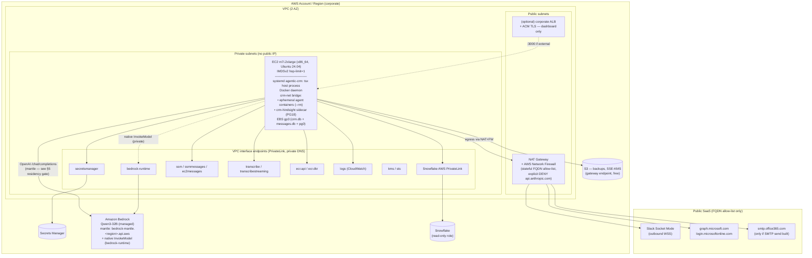

# Pulso-Aura (Azteca-Aura) — AWS EC2 + Bedrock Migration Technical Map

**Repo:** `EurekaMD-net/Pulso-Aura-Upfront` · **Date:** 2026-06-30
**Current home:** Hostinger VPS, systemd unit `agentic-crm` (`tsx engine/src/index.ts`, Node 22, port 3000)
**Target:** Corporate AWS — EC2 host + Amazon Bedrock (managed Qwen3-32B). Corporate platform profile: **Snowflake** = sole data provider · **Microsoft 365 / Graph** = workspace (replaces Google) · **Slack** = sole channel (replaces WhatsApp) · **Amazon Bedrock** = inference (replaces Groq/Fireworks).

> Audience: infrastructure team. Every current-state claim carries `file:line` evidence. AWS-capability claims were verified against AWS docs this session (sources at the end). Anything not provable from code or docs is in **§15 Open Decisions**, not asserted.

---

## 1. Executive Summary

**Core thesis.** Because Bedrock serves Qwen3-32B fully managed/serverless, **the EC2 host needs no GPU** — the prior self-host plan's "GPU concurrency risk #1" is eliminated outright (repo-wide `grep gpu|cuda|nvidia` → 0 hits; inference, embeddings and transcription are all remote HTTP). The **generation layer is a near-config-only repoint** of `INFERENCE_PRIMARY_URL/MODEL/KEY` at the OpenAI-compatible Bedrock **mantle** endpoint, because `crm/src/inference-adapter.ts` already POSTs `${baseUrl}/chat/completions` with `Authorization: Bearer ${key}` (inference-adapter.ts:148-176,214-222). The only **net-new application development** is **Microsoft 365 (Graph) workspace** and the **Slack channel** — both seams already exist (`WorkspaceProvider` factory with a pre-scaffolded `microsoft` branch; a `Channel` interface with a 291-line Slack impl living as an un-promoted skill).

**Is this smooth? — Qualified yes, with four hard gates.** The lift-and-shift of the host process + Docker fan-out + SQLite store is mechanically simple, and Bedrock removes the heaviest infra risk. But "config-only" is an over-simplification: the move is **config-PLUS-thin-code**. Four things must clear before cutover, or the bot silently degrades: **(1)** OpenAI-shaped `tool_calls` round-trip on `bedrock-mantle` for `qwen.qwen3-32b` (mantle documents built-in tool use — encouraging, but the exact `tool_calls` block + streaming-delta shape must be probed, because the agent's ~76 tools and every state-changing DB write depend on it); **(2)** the real inference path (`bedrock-mantle.<region>.api.aws`) must be reachable **privately** — PrivateLink is confirmed for `bedrock-runtime` but **not** for `bedrock-mantle`, so residency for the actual hot path is unresolved and is an F0 gate; **(3)** a **hot key-reload mechanism** for the ≤12h Bedrock short-term key, because a running `tsx` process reads `process.env` fixed at boot — otherwise key expiry is a recurring scheduled outage; **(4)** the **channel switch is inherently big-bang** (Slack IDs replace WhatsApp JIDs; live traffic cannot be shadowed into both stacks). Net: technically tractable, **not** a flag-flip — budget the four gates, the MS365 document-generation sub-project, and a defined freeze/point-of-no-return window.

---

## 2. Architecture: Current (VPS) → Target (AWS)

### 2.1 Current (VPS)

- **One host process** (`tsx engine/src/index.ts`, systemd `agentic-crm`) owns: the WhatsApp channel (Baileys), the scheduler, the dashboard HTTP `:3000` (dashboard/server.ts:319), and the credential proxy `:7462` (config.ts:77).
- **Per-message ephemeral Docker containers**: the host shells `docker run -i --rm --network crm-net … agentic-crm-agent:latest` once per inbound message (container-runner.ts:298,331,404). `MAX_CONCURRENT_CONTAINERS=3`; each capped `CONTAINER_MEMORY=512m / CONTAINER_CPUS=1 / CONTAINER_PIDS_LIMIT=256` (config.ts:68-73,82).
- **Data**: embedded SQLite `data/store/crm.db` (~206 MB, 32 tables, `journal_mode=DELETE`, sqlite-vec + FTS5 in-file; db.ts:19-44, schema.ts:484-517) + `store/messages.db` (channel/session/scheduler) + Hindsight sidecar (embedded PG18 in `data/hindsight`, optional; degrades to SQLite).
- **Egress** (today): Groq/Fireworks inference, DashScope embeddings, external Whisper, Brave, QuickChart, Bitly, FX/weather/holidays, Jarvis, Snowflake, Google Workspace. (Full inventory §9.)

### 2.2 Target (AWS) topology

**Storage rule (hard):** all SQLite files live on **EBS (block)**, never EFS/NFS — SQLite `DELETE`-journal + `busy_timeout=5s` locking is unsafe over NFS, and host↔container bind-mount RW sharing (container-runner.ts:225-249) assumes a local block FS. Host and agent containers stay **co-located on one instance** so the bind mount remains local.

---

## 3. Compute (EC2)

| Decision         | Recommendation                                                                                                                                                                                                | Rationale / evidence                                                                                                                                                                                                                                                                                        |
| ---------------- | ------------------------------------------------------------------------------------------------------------------------------------------------------------------------------------------------------------- | ----------------------------------------------------------------------------------------------------------------------------------------------------------------------------------------------------------------------------------------------------------------------------------------------------------- |
| GPU              | **None.** CPU-only.                                                                                                                                                                                           | Bedrock managed; 0 GPU refs in code; Lightpanda is CPU-only (Zig). Prior g6e plan dropped.                                                                                                                                                                                                                  |
| Instance         | **m7i.xlarge** (4 vCPU/16 GiB) pilot → **m7i.2xlarge** (8 vCPU/32 GiB) prod                                                                                                                                   | Peak ≈ host tsx (~0.5–1.5 vCPU) + 3×capped containers (~1.5–2.5 vCPU/1.5 GB) + Hindsight (~0.5 vCPU) + daemon/OS. At 4 vCPU the 3×`CONTAINER_CPUS=1` caps starve host+Hindsight under fan-out; 8 vCPU removes contention. `MAX_CONCURRENT_CONTAINERS` is the scaling lever — raising it bumps the instance. |
| Arch             | **x86_64** for cutover; Graviton deferred                                                                                                                                                                     | Both images x86_64; base Dockerfile hardcodes `lightpanda-x86_64-linux` (engine/container/Dockerfile:19-22). Graviton = rebuild both images for arm64 + swap Lightpanda binary → post-migration workstream, must not gate cutover.                                                                          |
| AMI/OS           | **Ubuntu 24.04 LTS** (AL2023 acceptable)                                                                                                                                                                      | Both Dockerfiles + operator tooling apt-based → dev/prod parity. Both support `--add-host host-gateway` (Docker ≥20.10).                                                                                                                                                                                    |
| Docker + crm-net | Docker CE ≥24; **provision `crm-net` at boot** via oneshot/`ExecStartPre docker network create crm-net                                                                                                        |                                                                                                                                                                                                                                                                                                             | true`; attach Hindsight to it; order `agentic-crm` `After=docker.service network-online.target Requires=docker.service` | Engine aborts if `docker info` fails; every spawn passes `--network crm-net`; **missing network ⇒ every message fails `docker run` exit 125, silently** (systemd stays `active`). Network is never created by code. |
| Image registry   | **ECR** + `amazon-ecr-credential-helper`; instance profile `ecr:GetAuthorizationToken/BatchGetImage/GetDownloadUrlForLayer/BatchCheckLayerAvailability`; reference a **pinned digest** not `:latest`          | Auto-auth `docker run` pulls; also self-heals the prune trap (a stray prune ⇒ re-pull). Build (github Lightpanda + npm) moves to **CodeBuild**, off the runtime host.                                                                                                                                       |
| Prune policy     | Keep **`LABEL keep="true"`** baked in both Dockerfiles (crm/container/Dockerfile:35, engine/container/Dockerfile:10); any host prune cron MUST carry `--filter "label!=keep=true"`; back with ECR pull-on-run | `--rm` images look unused between messages; a naive GC mutes the bot with `/health` still 200. Already bit the bot once (LEARNINGS-2026-06-22-IMAGE-PRUNE-TRAP).                                                                                                                                            |
| Storage          | EBS **gp3, 100 GB, 3000 IOPS** for repo + data/store SQLite + `/var/lib/docker`; **load-test IOPS** under fan-out before locking                                                                              | crm.db is the irreplaceable store; DELETE-journal + concurrent host/container writers — see Risk R-13.                                                                                                                                                                                                      |
| systemd unit     | Port verbatim: WorkingDirectory=repo root, ExecStart=`tsx engine/src/index.ts`, `TZ=America/Mexico_City`, `Restart=on-failure RestartSec=10`, `EnvironmentFile` from a Secrets-Manager entrypoint shim        | Host process unchanged; only env-source + ordering deps change.                                                                                                                                                                                                                                             |
| Run-user         | **Decide root vs uid-1000 before cutover** and chown `data/`, `groups/`, `store/` accordingly                                                                                                                 | container-runner run-as-user branch keys off host UID (container-runner.ts:339-346); mismatch ⇒ permission errors on writable mounts.                                                                                                                                                                       |
| HA               | `Restart=on-failure` (process exit) + ASG min=1/max=1 (auto-replace) + EBS-backed AMI; **alarm on the canary, not `/health`**                                                                                 | Restart handles crashes; it does **not** detect silent-mute modes (image pruned, crm-net missing, key expired) that leave systemd `active`. See §8.                                                                                                                                                         |
| IMDS             | **IMDSv2 + hop-limit=1**; block `169.254.169.254` from crm-net containers (bridge/iptables rule)                                                                                                              | Agent containers run arbitrary tool code; without a hop-limit a prompt-injected container can read the instance-role creds and assume the Bedrock/Secrets/ECR role (critic gap G5).                                                                                                                         |
| Credential proxy | **Keep the default restrictive bind** (container-runtime auto-detect / docker0); **do NOT set `CREDENTIAL_PROXY_HOST=0.0.0.0`**; never expose `:7462`                                                         | **Contradiction resolved:** the only consumer (Anthropic-SDK agent-runner) is bypassed by the CRM Dockerfile ENTRYPOINT override — containers never need the proxy. The Sec-1 `0.0.0.0` suggestion is rejected; pair with unset `ANTHROPIC_*` + Network-Firewall DENY `api.anthropic.com`.                  |

---

## 4. Inference & AI services (Bedrock)

**The swap surface** (`crm/src/inference-adapter.ts`): `loadProviders()` reads `INFERENCE_PRIMARY/FALLBACK_{URL,KEY,MODEL}`; `callProvider()` POSTs `${baseUrl}/chat/completions` with `Authorization: Bearer ${key}` and, when tools present, `tools` + `tool_choice:"auto"`. URL/MODEL/KEY are a pure config swap **and the Bearer header already matches a Bedrock API key.**

### 4.1 Generation — config + thin code (not config-only)

- **Primary:** `INFERENCE_PRIMARY_URL=https://bedrock-mantle.<region>.api.aws/v1` · `INFERENCE_PRIMARY_MODEL=qwen.qwen3-32b` · `INFERENCE_PRIMARY_KEY=<Bedrock API key>`. **Verified:** mantle supports the OpenAI Chat Completions API with `qwen.qwen3-32b` and documents **built-in tool use** — a base-URL + key swap for an OpenAI SDK codebase.
- **Thinking-mode (CODE, net-new):** `reasoning_effort:"none"` fires only when `/groq/i.test(baseUrl)` AND `/qwen3/i.test(model)`; the `enable_thinking:false` branch only when model startsWith `qwen3`/`glm-` (inference-adapter.ts:248-255). A `bedrock-mantle` baseUrl + model `qwen.qwen3-32b` matches **neither** → thinking stays ON → latency/cost spike + `<think>` leakage. **Add a Bedrock branch** and confirm the disable-thinking knob mantle honors for Qwen3 (`reasoning_effort` vs `enable_thinking` vs `extra_body`). This is why the thesis is "config-PLUS-code."
- **Context/token resize (CONFIG):** drop `INFERENCE_CONTEXT_LIMIT≈30000`, `INFERENCE_TOKEN_BUDGET≈24000`, keep `INFERENCE_MAX_TOKENS≤8000` (2048 fine). Qwen3-32B Bedrock window ≈32K/8K-out — at the 100k default the deterministic compressor never fires before Bedrock 400s/truncates under the ~26k-baseline persona + ~76 tool defs. **Confirm exact limits against the model card (§15-D7).**
- **Tool-call parity GATE (F0):** run the repo's `scripts/inference-probe.ts` + `inference-bench.ts` against the **live mantle endpoint** with the real Spanish tool schemas; assert well-formed `tool_calls` blocks **and** streaming `tool_call` index-deltas (`inferWithTools()` + `parseSSEStream()` hard-depend on them). **If imperfect:** front Bedrock with `aws-samples/bedrock-access-gateway` (maps OpenAI tools→Converse `toolConfig`) **or** add a bounded native-Converse adapter at the existing provider seam — no inference-adapter rewrite. Do **not** schedule F2 until green.
- **Fallback:** `INFERENCE_FALLBACK_*` → `qwen.qwen3-32b` in a **second Bedrock region** (Qwen3-32B is In-Region only — confirm cross-region profile availability, §15-D7). If vision is needed, point the fallback at a Bedrock vision model (qwen3-vl / Nova / Claude) since qwen3-32b is text-only.

### 4.2 Embeddings — NOT a base-URL swap

- Bedrock's OpenAI/mantle surface is chat/Responses only — **no `/v1/embeddings`**. Pointing `EMBEDDING_URL` at mantle 404s and `embedding.ts` **silently falls back to the local trigram hash** (degraded, non-semantic).
- **Choose one:** (A) deploy `bedrock-access-gateway` in-VPC exposing `/v1/embeddings` → `EMBEDDING_URL` stays config-only; or (B) add a native-Bedrock `InvokeModel` embeddings adapter in `crm/src/embedding.ts`.
- **Model:** Amazon Titan Text Embeddings V2 @ **1024 dims** (matches `vec0(embedding float[1024])`, no schema change) or Cohere Embed Multilingual (1024, better Spanish recall — **validate with a Spanish retrieval regression**, §15-D6; dimension count ≠ recall quality).
- Auth: `embedding.ts` uses `INFERENCE_PRIMARY_KEY` (no `EMBEDDING_KEY`); share the Bedrock key via the gateway, or add an `EMBEDDING_KEY` env.

### 4.3 Re-embed migration (one-time, see §6.2 for the dual-write correction)

Re-embed all **17,986 chunks / 971 documents** (`crm_embeddings` → rebuild `crm_vec_embeddings`); FTS5 keyword table untouched. New model = new vector space; same 1024 dims does **not** make old vectors compatible. **Use a dedicated stable/long-term key for this job** (critic G9) — if it outruns the ≤12h key TTL, calls 401 and poison the table with trigram vectors.

> Count reconciliation (critic contradiction): **17,986 chunks / 971 documents** = the RAG corpus in `crm_vec_embeddings`/`crm_documents` (the thing re-embedded). **"320 brands / 969 findings"** = the upstream **Aura KB** knowledge layer that _seeds_ a subset of those documents. Size the migration on **17,986**.

### 4.4 Transcription (confidential audio — hidden egress today)

`transcription.ts` POSTs OpenAI Whisper multipart to `/audio/transcriptions`. Bedrock has no Whisper. **Options:** (A) self-host faster-whisper/whisper.cpp (CPU) in crm-net exposing OpenAI `/v1/audio/transcriptions` → `transcription.ts` stays config-only, audio never leaves VPC; (B) Amazon Transcribe es-MX over a Transcribe VPC endpoint — **not OpenAI-shaped**, needs a net-new adapter + an AWS Organizations AI-services **opt-out policy** (Transcribe may otherwise store/use audio). **Plus audio transcoding** (Slack/WhatsApp OGG/Opus → Transcribe-accepted encoding/sample-rate) — not "thin." Whisper backend is a **decision gate before sizing** (it's the only lever that could pull a GPU back).

### 4.5 Hindsight memory inference

The Hindsight sidecar makes its **own** external LLM egress (`HINDSIGHT_API_LLM_BASE_URL/MODEL/KEY`, DashScope today per `rotate-dashscope.sh`) for consolidation — invisible in this repo. **Repoint to Bedrock** (or disable consolidation); include/exclude it explicitly from the egress allow-list. Memory is regenerable (SQLite fallback), so EBS-backed sidecar is the low-risk choice (no RDS at cutover). Confirm whether Hindsight embeds internally (§15-D5).

### 4.6 Neutralize the vestigial Anthropic path

Leave `ANTHROPIC_API_KEY`/`CLAUDE_CODE_OAUTH_TOKEN`/`ANTHROPIC_AUTH_TOKEN` **unset** (proxy starts keyless, any call 502s); Network-Firewall **DENY `api.anthropic.com`**; optionally gate off `startCredentialProxy()` and strip `@anthropic-ai/claude-code` + lightpanda/`mcp__browser` from the agent image in a cleanup pass.

---

## 5. Networking, Security & Residency

### 5.1 VPC topology

Single VPC, 2 AZs. **Private** subnets: the EC2 host (**no public IP**) + all interface-endpoint ENIs. **Public** subnets: one NAT Gateway (+ AWS Network Firewall) and, only if the dashboard must be externally reachable, a corporate ALB. `crm-net` stays a host-local Docker bridge; containers egress through the host. Slack Socket Mode is outbound-only, so the host needs **zero inbound surface**; admin via **SSM Session Manager** (no bastion).

### 5.2 VPC endpoints (PrivateLink) — keep traffic off the internet

Interface endpoints w/ Private DNS: `bedrock-runtime`, `secretsmanager`, `ssm`+`ssmmessages`+`ec2messages`, `transcribe`+`transcribestreaming`, `ecr.api`+`ecr.dkr`, `logs`, `kms`, `sts`. Gateway endpoint (free): `s3`. **Snowflake AWS PrivateLink** via `SYSTEM$GET_PRIVATELINK_CONFIG` + private hosted zone. Attach a restrictive endpoint policy to `bedrock-runtime`.

> **⚠ Residency gate (critic blocker #2, F0).** **Verified:** PrivateLink exists for `com.amazonaws.<region>.bedrock-runtime`. **NOT verified:** that the actual Qwen3-32B inference path, `bedrock-mantle.<region>.api.aws`, is exposed through any VPC interface endpoint. If mantle has **no** PrivateLink, every confidential prompt (deal values, advertiser names, transcripts) egresses over the **public internet via NAT**, defeating residency, while the `bedrock-runtime` endpoint sits unused. **Resolution path (decide at F0, §15-D1):** (a) confirm a mantle PrivateLink service from a no-public-IP subnet; if absent → (b) front Bedrock with `bedrock-access-gateway` calling **native `InvokeModel`/Converse over the `bedrock-runtime` PrivateLink endpoint** (which _is_ private), and point `INFERENCE_PRIMARY_URL` at the in-VPC gateway. Option (b) also solves the tool-call-parity gate in one move.

### 5.3 NAT + AWS Network Firewall (the only public path)

SGs **cannot filter by FQDN**, so a **stateful egress firewall** is mandatory to actually block `api.anthropic.com` and enforce "egress = approved set." Allow-list: `slack.com`/`*.slack.com` (WSS), `graph.microsoft.com` + `login.microsoftonline.com`, `smtp.office365.com` (only if SMTP send is implemented). **Explicit DENY `api.anthropic.com`.** Drop/internalize the public utility APIs so they never reach the allow-list. **Cost reality (critic G3):** Network Firewall ≈ **$0.395/hr/endpoint (~$288/mo) + $0.065/GB** — roughly **doubles** the infra line (§14). It also adds inspection latency on the per-message path. _If_ the residency gate resolves to a fully-private Bedrock/Snowflake/Transcribe posture and Slack/Graph egress is acceptable to police with a narrower control, a single-AZ firewall endpoint can be weighed against the cost in §15-D9.

### 5.4 Security Groups & IAM

Instance SG ingress: **none** from internet (ALB-SG-only `:3000` if external). Egress: 443 to endpoint-ENI SG + Snowflake-PL ENI + NAT; default-deny. Per-endpoint SGs allow 443 only from the instance SG.
IAM instance role (least-priv): `bedrock:InvokeModel(+WithResponseStream)` scoped to approved model ARNs + the action minting the short-term Bedrock API key; `transcribe:StartStreamTranscription/StartTranscriptionJob`; `secretsmanager:GetSecretValue` (scoped ARNs) + `kms:Decrypt`; `ssm:GetParameter(s)`; ECR read; `s3:Get/PutObject` on the backup bucket; `logs:CreateLogStream/PutLogEvents`. Everything else (Snowflake/Slack/Graph/SMTP) authenticates with its own Secrets-Manager secret, not IAM.

### 5.5 Bedrock auth + the hot key-reload requirement (critic blocker #3 / G2)

The OpenAI/mantle path authenticates with a **Bedrock API key (bearer)**, not SigV4. Short-term keys are session-derived, **≤12h**, recommended for prod. **But `loadProviders()` reads `process.env` fixed at host boot** (entrypoint shim) and `readSecrets()` snapshots it per spawn — **writing a new key to Secrets Manager/.env does NOT update the running `tsx` process.** Unmitigated, key expiry = all inference 401s until a `systemctl restart` that drops in-flight containers — a **recurring scheduled mini-outage.** Resolve with one of:

1. **Hot-reload (preferred, net-new ~S):** a refresh sidecar writes the key to a file/secret; modify the key source so `callProvider()` re-reads it (key-file read per request, or `SIGHUP` handler refreshing the cached provider). Small, contained change at the provider seam.
2. **Long-term Bedrock API key** in Secrets Manager (simplest; **conflicts with the short-term-key guidance** — a deliberate tradeoff: standing credential vs. operational reload complexity; record in §15-D-auth).
3. Drain-aware rolling restart on rotation (acceptable only if in-flight drops are tolerable).

### 5.6 Container DNS for PrivateLink (critic G4)

Agent containers on `crm-net` use Docker embedded DNS `127.0.0.11`, which forwards to the **host** `/etc/resolv.conf` (VPC resolver `.2`). Private DNS on the endpoints only holds if that chain resolves the **private** endpoint IPs. **Validate** from inside a running agent container that `bedrock-*`/`transcribe`/`secretsmanager` hostnames resolve to the interface-endpoint private IPs — the in-container inference fetch (EGRESS #1 runs **inside** the container) bypasses PrivateLink otherwise.

### 5.7 Bedrock data governance (missing dimension)

Confidential advertiser prompts hit managed Bedrock and may land in **CloudWatch Logs**. Decide: Bedrock **model-invocation logging** on/off + retention; an AWS Organizations **AI-services posture for Bedrock** (Transcribe got an opt-out; Bedrock needs an explicit stance); KMS-encrypt + restrict log access; an **AWS DPA / SCP guardrails** + data-classification sign-off for prompts/embeddings/audio leaving the CRM box. (§15-D-gov.)

---

## 6. Data & Persistence

### 6.1 crm.db — lift-and-shift, do NOT move to RDS

Keep SQLite + sqlite-vec + FTS5 on a dedicated **EBS gp3** volume; mount stays local so agent containers keep bind-mounting it RW (CRM_DB_PATH=`/workspace/extra/crm-db/crm.db`). Moving to managed Postgres = rewriting the entire data layer (`better-sqlite3`→pg, sqlite-vec→pgvector, FTS5→tsvector, every prepared statement) **and** re-architecting container DB access — a project, not a migration. **Copy** via EBS-snapshot/restore or `sqlite3 .backup`; **verify table + row counts** (esp. `anunciante_snowflake_map`, `anunciante_marca`, `cierre_meta`, `crm_documents`) pre/post — the Snowflake join key travels **inside** crm.db (no separate step), and losing it degrades the whole P4 factual layer.

### 6.2 Re-embed without a possible dual-write (critic G7 — contradiction resolved)

`crm_vec_embeddings` is a **single `vec0 float[1024]`** table — you **cannot** hold two incompatible vector spaces in it. "Dual-write" (Sec 2) is architecturally impossible in-table; the real behavior is **FTS5-keyword-only semantic search for the entire re-embed window** (Sec 4's framing is the correct one). To minimize the blind window, build a **shadow table** `crm_vec_embeddings_new` (or a shadow crm.db), re-embed 17,986 chunks into it, then **atomically swap** (rename) at cutover — degraded recall is bounded to the swap instant, not the whole re-embed. Run a **recall regression** (known doc → expected hit) before swap.

### 6.3 messages.db — Slack is net-new state

On the same EBS volume, but `registered_groups`/`chats`/`messages`/`sessions` are **WhatsApp-JID-keyed** and must be **re-created for Slack channel IDs** by the new adapter. Optionally migrate `scheduled_tasks`/`task_run_logs` (channel-agnostic) if recurring jobs must persist. Discard `store/auth/` (Baileys).

### 6.4 Hindsight — EBS-backed sidecar

Keep the container on EC2 with `pg0` on EBS; repoint its LLM egress to Bedrock; **optional** `pg_dump/pg_restore` if learned-memory continuity matters (else lazily rebuilt). External/RDS PG support is unverified — do not force RDS at cutover (§15-D5).

### 6.5 Snowflake from the VPC — PrivateLink (contradiction resolved)

**Use AWS PrivateLink** (Sec 3 wins over Sec 5's NAT-EIP path): interface VPC endpoint via `SYSTEM$GET_PRIVATELINK_CONFIG`, private hosted-zone CNAMEs, SG 443 **+80** (Snowflake OCSP), dedicated **read-only role** + network policy allow-listing the VPCE, **key-pair auth** (`SNOWFLAKE_PRIVATE_KEY_PATH`, PEM in Secrets Manager). **Remove Snowflake from the NAT allow-list.** Its PrivateLink endpoint cost is added to §14.

> **Where does the Snowflake tool run? (critic G6 — open).** `SNOWFLAKE_*` is a **host-only** secret, **absent** from the container stdin allowlist (container-runner readSecrets). So either the factual-layer Snowflake tool executes **host-side** (and Snowflake PrivateLink need only be reachable from the host), or it runs **in-container and is silently unconfigured** (returns "not configured", P4 dead on AWS). **Must confirm** the execution surface (§15-D-snow). If in-container: add `SNOWFLAKE_*` to the allowlist **and** make the VPCE reachable from `crm-net`.

### 6.6 Backups / snapshots / RPO-RTO (missing dimension)

Replace the Supabase backup target with **EBS snapshots via DLM** (hourly + daily) + a nightly **`VACUUM INTO`/`.backup` of crm.db + `pg_dump` of Hindsight** to **S3 (versioned, SSE-KMS, lifecycle→Glacier)**. Retire `crm-backup.timer`/`crm-mirror.timer`. **Set explicit RPO/RTO targets** (today's 15-min cadence implies ≤15-min loss; restore-RTO is currently only "rehearse it") — for an irreplaceable system-of-record, state a number and **rehearse a test restore** as an F4 gate.

### 6.7 EBS IOPS validation (missing dimension)

gp3 3000 IOPS baseline is asserted, never load-tested against the `DELETE`-journal + `busy_timeout=5s` pattern under concurrent host+container writers during fan-out. **Load-test before locking the volume size/IOPS**; bump provisioned IOPS if SQLite write latency surfaces.

---

## 7. Net-new Integrations (Slack + Microsoft 365)

### 7.1 Slack (sole channel)

Seam exists: provider-agnostic `Channel` interface + `findChannel()` router (types.ts:81-90, router.ts:80-85). A **291-line `SlackChannel`** (Bolt Socket Mode, outbound queue, metadata sync, mention→trigger) lives as the **un-promoted `add-slack` skill** (skill `add/src/channels/slack.ts`), targeting a **stale 499-line `index.ts`** — **hand-merge, do NOT run `apply-skill.ts`** against the live ~600-line orchestrator.

- **Ingress/egress:** Socket Mode = outbound WSS only → **no inbound SG/DNS** (removes a whole class of cutover risk). Egress-only 443 to `slack.com`.
- **Net-new work:** promote+harden the channel (bounded metadata pagination); **voice-note + file handling** (download via bot token → `transcribe()`, mirror whatsapp.ts:244-323; add `files:read`); **persona→channel mapping** (bind each `slack:Cxxxx` to a CRM persona so the agent acts as the right AE and uses that `persona.email` for workspace tools); **mrkdwn formatter** + smart split; **thread-aware routing** (`thread_ts`) is an **explicit v1/v1.1 decision** (skill flattens replies to channel root).
- **IT long-lead:** Enterprise Grid **org-admin app approval** (Socket Mode apps can't be Marketplace-listed but _are_ allowed for internal distribution) — **file at project start.**

### 7.2 Microsoft 365 (Graph workspace)

Seam exists: `WorkspaceProvider` interface + factory already **branches on `WORKSPACE_PROVIDER=microsoft`** and `isWorkspaceEnabled()` checks `MICROSOFT_TENANT_ID/CLIENT_ID/CLIENT_SECRET`, but `getProvider()` **throws "not yet implemented"** (provider.ts:20-39). All 6 tool families consume the provider through this single factory → a correct `MicrosoftProvider` lights up every tool with no tool-layer edits.

- **Auth rewrite (biggest):** Google uses per-call JWT + domain-wide delegation (`subject` impersonation). Graph has **no `subject`** — build `crm/src/workspace/microsoft/auth.ts` on `@azure/msal-node` `ConfidentialClientApplication` (client-credentials, in-memory token cache+refresh) + `@microsoft/microsoft-graph-client`; act "as" a persona via `/users/{upn}/...` under **Application permissions**.
- **Least-privilege (launch gate):** `Mail.Send`/`Calendars` application permission grants **send-as-ANY-mailbox tenant-wide** — mandate **`New-ApplicationAccessPolicy` / RBAC for Applications** scoping to persona mailboxes/sites **before go-live**, not a follow-up.
- **`createDocument` parity (hardest, ~1–1.5 wk):** Graph has no Slides/Sheets `batchUpdate` analog → re-implement Word `.docx`/PowerPoint `.pptx` upload + Excel **workbook API**. **Launch decision (critic G10, §15-D-doc):** ship **mail + calendar + file-read first**, document-generation as a fast-follow — otherwise this single sub-item slips the whole cutover.
- **Container creds:** add `MICROSOFT_TENANT_ID/CLIENT_ID/CLIENT_SECRET` + `WORKSPACE_PROVIDER` to the container `readSecrets()` allowlist or in-container drive/gmail/calendar tools see an unconfigured workspace.
- **persona.email = Entra UPN?** (launch gate) — if not, every Graph `/users/{upn}` call **404s**, breaking all MS365 tools at once. **Reconcile to verified UPNs** + add a `User.Read.All` startup validation.
- **Cutover switch:** `WORKSPACE_PROVIDER=microsoft` + `SLACK_ONLY=true`; keep Google/WhatsApp installed during transition, delete only after parity proven.

---

## 8. Operations & Observability

- **Release:** SSM Run Command / CodeDeploy → `git pull` → clear `/tmp/tsx-*` → `systemctl restart agentic-crm`. CI image pipeline (CodeBuild → ECR pinned digest).
- **Logs:** CloudWatch agent ships journald + container stdout (over the `logs` endpoint). **Govern** confidential prompt content in logs (§5.7).
- **Liveness — canary, not `/health` (contradiction resolved).** `/health` returns `{status:ok}` without exercising spawn or inference (server.ts:143); **`systemd active` + HTTP 200 both lie** about the silent-mute modes (image pruned, crm-net missing, key expired). Drive **alerting** off a **synthetic round-trip canary** (EventBridge → synthetic Slack message → agent container → Bedrock → reply). Keep `Restart=on-failure` for _crash recovery_ — the two are complementary, not contradictory: restart = recover from process exit; canary = detect mutes that leave the process alive.
- **Metrics/alarms:** canary fail; container-spawn failures; inference-fallback rate; Bedrock throttle (4xx/TPM); disk >80%; key-refresh failure.
- **Bedrock quota (missing dimension):** request **TPM/RPM increases early** (long-lead) and decide **Provisioned Throughput** if sales bursts risk 429s; an external fallback on throttle would re-open an egress — keep the fallback in-VPC/in-region.
- **Change management (missing dimension):** the WhatsApp→Slack switch is **big-bang and human-facing** — plan AE training, Slack app install per user, and a **staged pilot** (subset of sellers) before full cutover. There is no traffic shadow.

---

## 9. Complete Egress / Ingress Inventory

| #   | Flow                                                     | Direction           | Today                               | Gated?                   | AWS target                                          | On NAT allow-list?                          |
| --- | -------------------------------------------------------- | ------------------- | ----------------------------------- | ------------------------ | --------------------------------------------------- | ------------------------------------------- |
| 1   | Inference `/chat/completions` (**in container**)         | egress              | Groq/Fireworks                      | by config                | Bedrock **mantle** (PrivateLink gate §5.2)          | No (private) — else NAT until gate resolved |
| 2   | Embeddings `/embeddings`                                 | egress              | DashScope                           | by config                | Bedrock via gateway / native InvokeModel            | No (private)                                |
| 3   | Whisper `/audio/transcriptions` (host)                   | egress              | external Whisper                    | URL+KEY                  | self-host in-VPC **or** Transcribe (endpoint)       | No                                          |
| 4   | Brave Search                                             | egress              | api.search.brave.com                | by key                   | make optional / approved gateway                    | No (drop)                                   |
| 5   | **QuickChart** (deal values!)                            | egress              | quickchart.io, **no auth, no gate** | **none**                 | **self-host in crm-net or disable**                 | **No — must not appear**                    |
| 6   | Bitly shortener                                          | egress              | api-ssl.bitly.com                   | only if raw-IP dashboard | real domain disables it                             | No                                          |
| 7-9 | FX / weather / holidays                                  | egress              | frankfurter/open-meteo/nager        | none                     | internalize/cache                                   | No                                          |
| 10  | Jarvis pull                                              | egress              | JARVIS_API_URL                      | by key                   | in-VPC or drop (§15)                                | depends                                     |
| 11  | Snowflake                                                | egress              | *.snowflakecomputing.com            | by config                | **PrivateLink**                                     | **No (PrivateLink)**                        |
| 12  | Workspace                                                | egress              | Google APIs                         | by config                | **graph.microsoft.com / login.microsoftonline.com** | **Yes**                                     |
| 13  | Outbound email                                           | egress              | via provider (SMTP stub)            | by config                | Graph `sendMail` (SMTP O365 only if built)          | smtp.office365.com only if SMTP             |
| 14  | Hindsight (internal) + its own LLM egress                | egress              | crm-net + DashScope                 | gate                     | crm-net + **Bedrock**                               | No (repoint)                                |
| 15  | Anthropic credential-proxy (vestigial)                   | egress              | api.anthropic.com                   | —                        | **DENY at firewall, unset keys**                    | **Explicit DENY**                           |
| 16  | Lightpanda arbitrary-URL (dormant, engine path)          | egress              | any                                 | latent                   | strip from image                                    | No                                          |
| 17  | Build-time: Docker Hub / apt / github (Lightpanda) / npm | egress              | —                                   | —                        | **CI/CodeBuild + ECR + private mirror**             | No (build-time only)                        |
| I-1 | Dashboard `:3000` + `/go/<code>`                         | **ingress**         | DASHBOARD_BASE_URL                  | token                    | internal (SSM/VPN) **or** ALB+ACM                   | n/a                                         |
| I-2 | Slack Socket Mode                                        | egress (no ingress) | —                                   | —                        | outbound WSS, **no inbound**                        | Yes                                         |
| I-3 | IMDS `169.254.169.254` (container→host)                  | internal            | open                                | —                        | **block from crm-net + hop-limit=1**                | n/a                                         |

---

## 10. Env-var Repoint Map

| Var                                           | VPS value-source     | AWS target                                                               | Config-only?                         |
| --------------------------------------------- | -------------------- | ------------------------------------------------------------------------ | ------------------------------------ |
| `INFERENCE_PRIMARY_URL`                       | Groq `…/openai/v1`   | `https://bedrock-mantle.<region>.api.aws/v1` (or in-VPC gateway)         | **Config**                           |
| `INFERENCE_PRIMARY_MODEL`                     | `qwen/qwen3-32b`     | `qwen.qwen3-32b`                                                         | Config                               |
| `INFERENCE_PRIMARY_KEY`                       | Groq key             | Bedrock API key (Secrets Mgr) — **needs hot-reload §5.5**                | Config + **code (reload)**           |
| `INFERENCE_FALLBACK_*`                        | Fireworks            | 2nd-region Bedrock (and/or vision model)                                 | Config                               |
| `INFERENCE_CONTEXT_LIMIT`                     | default 100000       | **~30000** (32K window)                                                  | Config                               |
| `INFERENCE_TOKEN_BUDGET`                      | default 80000        | **~24000**                                                               | Config                               |
| `INFERENCE_MAX_TOKENS`                        | 2048                 | ≤8000 (2048 ok)                                                          | Config                               |
| (thinking-mode routing)                       | groq/qwen3 heuristic | **add Bedrock branch**                                                   | **Code (net-new)**                   |
| `EMBEDDING_URL`                               | DashScope/primary    | gateway `/v1/embeddings` **or** native adapter                           | **Config or net-new**                |
| `EMBEDDING_MODEL`                             | `text-embedding-v3`  | `amazon.titan-embed-text-v2:0` (1024)                                    | Config                               |
| `EMBEDDING_DIMS`                              | 1024 (hardcoded)     | unchanged                                                                | n/a                                  |
| `WHISPER_API_URL/KEY/MODEL`                   | external Whisper     | in-VPC Whisper (config) **or** Transcribe adapter                        | **Config or net-new**                |
| `HINDSIGHT_API_LLM_*`                         | DashScope            | Bedrock                                                                  | Config                               |
| `WORKSPACE_PROVIDER`                          | (google)             | `microsoft`                                                              | Config (behind net-new impl)         |
| `MICROSOFT_TENANT_ID/CLIENT_ID/CLIENT_SECRET` | referenced           | Entra app (Secrets Mgr) + add to container allowlist                     | Config + net-new impl                |
| `SLACK_BOT_TOKEN/APP_TOKEN/SLACK_ONLY`        | —                    | new (Secrets Mgr)                                                        | Config (behind net-new channel)      |
| `SNOWFLAKE_*`                                 | host env             | key-pair via Secrets Mgr + PrivateLink; maybe add to container allowlist | Config (+ allowlist if in-container) |
| `DASHBOARD_BASE_URL`                          | raw IP               | resolvable domain (internal or ALB)                                      | Config                               |
| `CONTAINER_IMAGE`                             | local tag            | ECR digest URI                                                           | Config                               |
| `CREDENTIAL_PROXY_HOST`                       | auto-detect          | **leave default (NOT 0.0.0.0)**                                          | Config                               |
| `ANTHROPIC_API_KEY/…/BASE_URL`                | set                  | **unset / sink**                                                         | Config                               |
| `TZ`                                          | America/Mexico_City  | unchanged (systemd)                                                      | Config                               |

---

## 11. Risk Register (severity-ranked)

| ID   | Risk                                                                                                                                                                                        | Sev      | Mitigation                                                                                                                                                                          |
| ---- | ------------------------------------------------------------------------------------------------------------------------------------------------------------------------------------------- | -------- | ----------------------------------------------------------------------------------------------------------------------------------------------------------------------------------- |
| R-1  | **`tool_calls` parity** on mantle for qwen.qwen3-32b unverified → state-changing DB writes (`registrar_actividad`, `cerrar_propuesta`) silently stop landing                                | **High** | F0 gate: probe with `inference-probe/bench.ts` on live mantle + Spanish schemas; fallback = bedrock-access-gateway / Converse adapter. Mantle docs built-in tool use (encouraging). |
| R-2  | **Residency leak on the real inference path** — inference goes to mantle, PrivateLink confirmed only for bedrock-runtime; mantle may have none → confidential prompts egress public via NAT | **High** | F0 gate §5.2: confirm mantle PrivateLink from a no-public-IP subnet; else route via bedrock-access-gateway→native InvokeModel over the bedrock-runtime PrivateLink endpoint.        |
| R-3  | **QuickChart** sends deal values to a third party, no auth/gate, every chart                                                                                                                | **High** | Self-host in crm-net or disable; keep off allow-list; verify zero egress.                                                                                                           |
| R-4  | **Context-limit mismatch** (100k default vs 32K) → compressor never fires → 400/truncate                                                                                                    | **High** | Lower limits in the same config change; verify a full turn fits.                                                                                                                    |
| R-5  | **Embedding-space swap** silently breaks recall (different space, same dims)                                                                                                                | **High** | Shadow-table re-embed + recall regression before atomic swap.                                                                                                                       |
| R-6  | **EFS misuse** for SQLite → lock corruption                                                                                                                                                 | **High** | Mandate EBS; document NEVER-EFS; co-locate host+containers.                                                                                                                         |
| R-7  | **MS365 send-as-any-mailbox** until ApplicationAccessPolicy scoping                                                                                                                         | **High** | Scope before go-live (launch gate).                                                                                                                                                 |
| R-8  | **persona.email ≠ Entra UPN** → all Graph tools 404                                                                                                                                         | High     | Reconcile UPNs + `User.Read.All` startup validation (migration).                                                                                                                    |
| R-9  | **12h key not picked up by running process** → recurring inference 401 outage                                                                                                               | **High** | Hot key-reload §5.5 (or long-term key tradeoff).                                                                                                                                    |
| R-10 | **crm-net / Hindsight missing at boot** → every spawn `docker run` exit 125, silent                                                                                                         | High     | Idempotent `ExecStartPre` create + ordering; attach Hindsight at boot.                                                                                                              |
| R-11 | **Image-prune trap** recurrence mutes bot, `/health` still 200                                                                                                                              | High     | Baked `LABEL keep=true`; prune cron `--filter label!=keep=true`; ECR pinned-digest self-heal; canary probe.                                                                         |
| R-12 | **IMDS credential theft** from injected agent container                                                                                                                                     | Medium   | IMDSv2 hop-limit=1 + block 169.254.169.254 from crm-net.                                                                                                                            |
| R-13 | **EBS IOPS** unvalidated for DELETE-journal concurrent writers                                                                                                                              | Medium   | Load-test before locking; bump provisioned IOPS.                                                                                                                                    |
| R-14 | **Network Firewall cost/latency** absent from prior model; doubles infra                                                                                                                    | Medium   | Budget ~$288/mo/endpoint + $0.065/GB (§14); single-AZ for pilot.                                                                                                                    |
| R-15 | **Container DNS** resolves public mantle/endpoint names → bypasses PrivateLink                                                                                                              | Medium   | Validate resolver chain from inside a container.                                                                                                                                    |
| R-16 | **Transcribe not OpenAI-shaped** + OGG/Opus transcoding + retention                                                                                                                         | Medium   | Self-host Whisper in-VPC (config-only) or adapter + opt-out policy + transcoder.                                                                                                    |
| R-17 | **Thinking-mode left on** for Bedrock → latency/cost + `<think>` leak                                                                                                                       | Medium   | Add Bedrock branch in callProvider(); confirm knob.                                                                                                                                 |
| R-18 | **Snowflake tool may be unconfigured in-container** → P4 factual layer dead                                                                                                                 | Medium   | Confirm execution surface; add to allowlist + crm-net VPCE if in-container.                                                                                                         |
| R-19 | **Re-embed job key expiry mid-run** poisons vectors with trigram                                                                                                                            | Medium   | Dedicated stable/long-term key for the migration job.                                                                                                                               |
| R-20 | **Bedrock throttling** under bursts → fallback re-opens egress                                                                                                                              | Medium   | Quota increases early; in-VPC fallback; Provisioned Throughput if SLA-critical.                                                                                                     |
| R-21 | **MS365 createDocument** parity slips the cutover if required at launch                                                                                                                     | Medium   | Ship mail/calendar/file-read first; doc-gen fast-follow (decision §15).                                                                                                             |
| R-22 | **Single EC2 + single EBS** = no multi-AZ HA                                                                                                                                                | Medium   | DLM snapshots + S3 `.backup`; ASG min=1 auto-replace; rehearse restore.                                                                                                             |
| R-23 | **Point-of-no-return** after first live Slack write — no reverse sync to VPS                                                                                                                | Medium   | Define PONR explicitly (§13 F4); short freeze; accept hard cutover.                                                                                                                 |
| R-24 | **Slack thread flattening** fragments corporate channels                                                                                                                                    | Medium   | Decide thread-aware routing as v1 vs v1.1 with stakeholders.                                                                                                                        |
| R-25 | **Long-lead IT gates** (Grid app approval, Entra consent) block launch                                                                                                                      | Medium   | File at project start.                                                                                                                                                              |
| R-26 | **Vestigial Anthropic/browser** reachable if code paths invoked/compromised                                                                                                                 | Low      | Firewall DENY + unset keys now; strip from image in cleanup.                                                                                                                        |
| R-27 | **24/7 EC2 vs bursty traffic**                                                                                                                                                              | Low      | m7i.xlarge pilot + Savings Plan or stop/start.                                                                                                                                      |
| R-28 | **Bedrock prompt/log governance** — confidential prompts in CloudWatch/Bedrock retention                                                                                                    | Medium   | Model-invocation-logging policy + KMS + AI-services posture + DPA (§5.7).                                                                                                           |

---

## 12. Dev-work Backlog

| Item                                                                                                                               | Type               | Effort    |
| ---------------------------------------------------------------------------------------------------------------------------------- | ------------------ | --------- |
| Repoint `INFERENCE_PRIMARY_*` → mantle; fallback → 2nd region                                                                      | config-only        | XS        |
| Lower context/token budget for 32K window                                                                                          | config-only        | XS        |
| Thinking-mode Bedrock branch + confirm disable-thinking knob                                                                       | net-new            | S         |
| **F0** tool_calls + streaming-delta parity probe on live mantle                                                                    | config-only (gate) | S         |
| Hot Bedrock-key reload (file/SIGHUP) — or long-term-key decision                                                                   | net-new            | S         |
| bedrock-access-gateway in-VPC (only if R-1/R-2/embeddings need it)                                                                 | infra              | M         |
| Embeddings: gateway `/v1/embeddings` (config) **or** native InvokeModel adapter                                                    | config / net-new   | S         |
| One-time re-embed 17,986 chunks via **shadow table** + atomic swap + recall regression (dedicated stable key)                      | migration          | M         |
| Transcription: self-host Whisper in-VPC (config) **or** Transcribe adapter + opt-out + OGG/Opus transcoder                         | net-new            | M         |
| Neutralize Anthropic: unset keys + firewall DENY (+ strip from image)                                                              | infra              | XS        |
| EC2 (m7i, x86_64, Ubuntu 24.04, private subnet, IMDSv2 hop-limit=1)                                                                | infra              | low       |
| EBS gp3 100GB + **IOPS load-test**                                                                                                 | infra              | low       |
| Docker CE + Node 22 + ecr-credential-helper                                                                                        | infra              | low       |
| ECR repos + CodeBuild build/push (pinned digest) + instance-profile ECR perms                                                      | infra              | M         |
| Boot crm-net provisioning + attach Hindsight                                                                                       | infra              | low       |
| Port systemd unit (After/Requires=docker, EnvironmentFile via Secrets shim)                                                        | config-only        | low       |
| Decide run-user + chown bind-mounts                                                                                                | migration          | low       |
| VPC + endpoints (bedrock-runtime, secretsmanager, ssm×3, transcribe×2, ecr×2, logs, kms, sts) + S3 gateway + Snowflake PrivateLink | infra              | M         |
| AWS Network Firewall egress allow-list + explicit anthropic DENY                                                                   | infra              | M         |
| SGs (instance + per-endpoint) + least-priv IAM role                                                                                | infra              | M         |
| Secrets Manager migration + entrypoint shim                                                                                        | infra              | low       |
| Block IMDS from crm-net (bridge/iptables)                                                                                          | infra              | low       |
| Container-DNS PrivateLink validation                                                                                               | infra              | low       |
| Snowflake: PrivateLink + key-pair + read-only role; confirm in-container vs host execution                                         | infra              | M         |
| Backups: EBS DLM + nightly S3 `.backup`/`pg_dump` (SSE-KMS); retire Supabase timers; set RPO/RTO + test restore                    | infra              | M         |
| CloudWatch agent + synthetic round-trip canary + alarms                                                                            | infra              | M         |
| **Slack**: promote+harden channel; voice/file; persona→channel map; mrkdwn+split; wire into index.ts (hand-merge); deps+tests      | net-new            | ~2–3 wk   |
| Slack thread-aware routing (v1.1)                                                                                                  | net-new            | ~3–5 d    |
| **MS365**: auth (MSAL)                                                                                                             | net-new            | ~3 d      |
| MS365: mail / files / calendar                                                                                                     | net-new            | ~6–9 d    |
| MS365: createDocument (.docx/.pptx/Excel workbook) — hardest                                                                       | net-new            | ~1–1.5 wk |
| MS365: provider + replace throw; container allowlist + deps                                                                        | net-new            | ~1 d      |
| MS365: persona.email→UPN reconcile + startup validation                                                                            | migration          | ~1–2 d    |
| Dashboard exposure (internal Route53/SSM **or** ALB+ACM)                                                                           | infra              | low/M     |
| Bedrock data-governance posture (logging/retention/AI opt-out/DPA)                                                                 | infra              | low       |
| IT (long-lead): Slack Grid app approval; Entra app + ApplicationAccessPolicy scoping                                               | infra (IT)         | external  |

---

## 13. Phased Migration Plan F0–F4

**F0 — Inference proof (no prod traffic).**
_Goal:_ prove the generation layer works and is private. _Steps:_ enable Bedrock Qwen3-32B; probe `tool_calls` + streaming deltas on live mantle with real Spanish schemas; measure concurrent latency; **confirm whether mantle has PrivateLink** (no-public-IP subnet) and pick the private path (mantle-PL vs gateway→InvokeModel). _Acceptance:_ tool_calls round-trip green; private inference path chosen + reachable; latency documented. _Rollback:_ N/A.

**F1 — Landing zone.**
_Goal:_ VPC + host + security, no prod traffic. _Steps:_ VPC/subnets/NAT+Network-Firewall, endpoints, SGs, IAM role, EC2+EBS, Docker+crm-net, Secrets Manager + entrypoint shim, IMDSv2 hop-limit=1, CloudWatch+canary, ECR pipeline. _Acceptance:_ reachable via SSM; secrets resolve; **observed egress = allow-list only**; api.anthropic.com denied; canary harness runs; container DNS resolves endpoints privately. _Rollback:_ teardown.

**F2 — Data + inference parity (shadow on a COPY of crm.db).**
_Goal:_ behavior parity on a fixed corpus. _Steps:_ deploy host+containers+Hindsight on a crm.db copy; repoint inference/embeddings/transcribe; hot-key-reload live; Snowflake read-only via PrivateLink; **shadow-table re-embed + atomic swap + recall regression**; run a fixed query-set parity harness + brand-firewall/RBAC suites. _Acceptance:_ behavior parity + suites green + canary green + recall regression passes + observed Bedrock egress is private. _Rollback:_ VPS stays system-of-record.

**F3 — Channel + workspace cutover build.**
_Goal:_ Slack + MS365 functional. _Steps:_ promote add-slack (`SLACK_ONLY=true`), persona→channel mapping, retire WhatsApp; build `workspace/microsoft` (mail/calendar/file-read first, doc-gen fast-follow); Entra app scoped via ApplicationAccessPolicy; persona.email→UPN reconcile. _Acceptance:_ Slack e2e incl. voice; MS365 send-mail/read-file/calendar; UPNs resolve; staged pilot (subset of AEs) green. _Rollback:_ re-enable WhatsApp via shared Channel interface; Google stays as fallback (pre-PONR).

**F4 — Production cutover.**
_Goal:_ AWS becomes system-of-record. _Steps:_ **freeze** crm.db on VPS → final snapshot/`.backup` → restore to EBS → re-embed delta if any → Slack re-registration → flip live; **test-restore verified**; real Director/Gerente e2e. _Acceptance:_ test restore verified within RTO; reconciled Snowflake figures with provenance; e2e pass. **Point-of-no-return:** _the first live Slack write to the AWS crm.db_ — there is **no reverse sync**, so any rollback after that loses AWS-side business writes. _Rollback (only before first live write):_ keep VPS hot, gate Snowflake tools off via `isSnowflakeConfigured`.

> **Parallel-run caveat:** because the channel itself changes (WhatsApp→Slack), live inbound traffic **cannot** be mirrored into both stacks. "Parallel run" here = behavior parity on a fixed corpus (F2) + a staged Slack pilot (F3) — **not** true dual-delivery. Set expectations accordingly; there is an unavoidable hard cutover instant.

---

## 14. Cost Model (single-AZ pilot, indicative, us-east-1 class)

| Line                                                                                 | Monthly                                                                |
| ------------------------------------------------------------------------------------ | ---------------------------------------------------------------------- |
| EC2 m7i.2xlarge on-demand ($0.4032/hr×730)                                           | ~$294 (m7i.xlarge ~$147 pilot; ~$185 w/ 1-yr Savings Plan)             |
| EBS gp3 100 GB                                                                       | ~$8                                                                    |
| NAT Gateway (+ $0.045/GB)                                                            | ~$33                                                                   |
| **AWS Network Firewall** (1 endpoint $0.395/hr + $0.065/GB) — _was omitted before_   | **~$288 + data**                                                       |
| ~~9–10 interface endpoints (~~$7.30/AZ-mo each)                                      | ~$70–80 single-AZ                                                      |
| Snowflake PrivateLink endpoint                                                       | ~$7–8 + data                                                           |
| Secrets Manager / CloudWatch / ECR storage / KMS / S3 backups                        | ~$25–35                                                                |
| **Infra subtotal**                                                                   | **≈ $720–760/mo** (vs the earlier $420–560 that excluded the firewall) |
| Bedrock Qwen3-32B tokens (≈$0.005/agentic message at ~24k in/1.5k out over ~3 turns) | ~$14/mo @100 msg/day · ~$140/mo @1,000 msg/day                         |
| Amazon Transcribe (if used)                                                          | ~$0.024/voice-min                                                      |

**Notes.** Still ~~3–5× cheaper than the g6e GPU baseline (~~$1.3–2.4k/mo) and the GPU SPOF + minutes-long vLLM cold start are gone. **Top token lever:** Bedrock prompt caching on the stable Aura system-prompt prefix (cache reads ~10% of input) — **verify Qwen3-32B supports it.** **Re-price for the actual residency region** (token price confirmed only for ap-southeast-2 historically). If the residency gate forces a bedrock-access-gateway, add a small Lambda/Fargate line.

---

## 15. Open Decisions for the Operator

**D1 — Residency F0 gate (highest):** Does `bedrock-mantle.<region>.api.aws` have a PrivateLink service? If **no**, accept the bedrock-access-gateway→native-InvokeModel-over-bedrock-runtime path (private) instead of direct mantle. _Blocks F2._
**D-auth — Bedrock key model:** hot-reload sidecar for the ≤12h short-term key, **or** a long-term key (simpler, against AWS guidance). _Blocks production inference stability._
**D-tools — tool_calls parity:** confirmed green on mantle? If not, gateway/Converse adapter (net-new). _Blocks F2._
**D2 — Whisper backend:** self-host CPU Whisper in-VPC (config-only, cleanest residency) vs Amazon Transcribe (adapter + opt-out + OGG/Opus transcoder) vs GPU self-host (would reintroduce a GPU). _Gates instance sizing._
**D-snow — Snowflake execution surface:** does the factual-layer tool run host-side or in-container? Determines whether `SNOWFLAKE_*` joins the container allowlist and whether the VPCE must reach crm-net. _Gates P4 on AWS._
**D-doc — MS365 createDocument at launch?** mail+calendar+file-read first with doc-gen fast-follow, or full parity (PowerPoint/Excel) required day-1 (~1–1.5 wk). _Gates cutover timeline._
**D3 — Region** (us-east-1 assumed): drives mantle URL, Qwen3-32B in-region availability, endpoint regions, and token re-pricing.
**D4 — MAX_CONCURRENT_CONTAINERS** target (default 3): drives m7i.xlarge pilot vs m7i.2xlarge prod.
**D5 — Hindsight continuity:** retain learned memory (`pg_dump`) or start fresh (SQLite fallback)? Does Hindsight embed internally / need its own residency review?
**D6 — Embedding model:** Titan v2 vs Cohere Embed Multilingual — decide on a Spanish recall regression.
**D7 — Qwen3-32B Bedrock model-card facts:** exact context/output limits + cross-region inference-profile availability (for the fallback strategy).
**D-net — Firewall posture & AZ count:** single-AZ firewall endpoint (cost) vs multi-AZ; is the ~$288/mo firewall acceptable, or is a narrower egress control viable once Bedrock/Snowflake/Transcribe are fully private?
**D-gov — Bedrock data governance:** model-invocation-logging on/off + retention; AI-services posture for Bedrock; DPA/SCP/data-classification sign-off; KMS-restricted log access.
**D-rpo — RPO/RTO targets** for the irreplaceable crm.db (today implies ≤15-min loss; restore RTO unstated).
**D8 — Dashboard exposure:** internal (SSM/VPN + internal Route53) vs ALB+ACM+JWT (external seller links → Bitly never invoked).
**D9 — Run-user** (root vs uid-1000) + bind-mount ownership.
**D10 — AMI standard:** Ubuntu 24.04 (parity) vs AL2023 (AWS-native SSM/CloudWatch).
**D11 — Jarvis backend:** kept in-VPC or dropped (`jarvis_pull` degrades to "not configured")?
**D12 — Slack org type & change management:** Enterprise Grid (org-admin approval, long-lead) vs single workspace; AE training/opt-in/app-install plan for the big-bang switch.
**D13 — Cutover freeze-window budget:** concrete duration of freeze + snapshot + delta re-embed + Slack re-registration, and the acceptable downtime.
**Note:** `.env`/`.env.example` are permission-guarded and were not read — all env values above are enumerated from `config.ts`/code defaults, not the live env file.

---

### Sources (AWS capability verification, this session)

- Qwen3-32B on Bedrock + mantle endpoint/built-in tool use: https://docs.aws.amazon.com/bedrock/latest/userguide/model-card-qwen-qwen3-32b.html · https://docs.aws.amazon.com/bedrock/latest/userguide/endpoints.html
- AWS Network Firewall pricing ($0.395/hr endpoint, $0.065/GB): https://aws.amazon.com/network-firewall/pricing/
- Bedrock VPC interface endpoints / PrivateLink (bedrock-runtime): https://docs.aws.amazon.com/bedrock/latest/userguide/vpc-interface-endpoints.html · https://docs.aws.amazon.com/bedrock/latest/userguide/usingVPC.html
