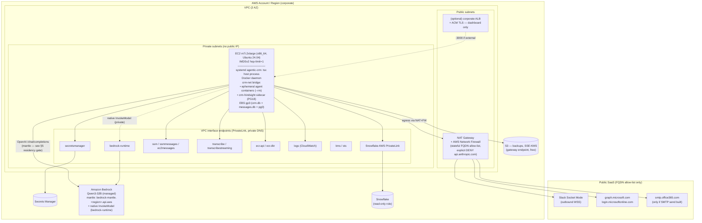

# Pulso-Aura (Azteca-Aura) — Mapa Técnico de Migración a AWS EC2 + Bedrock

**Repo:** `EurekaMD-net/Pulso-Aura-Upfront` · **Fecha:** 2026-06-30
**Hogar actual:** Hostinger VPS, unidad systemd `agentic-crm` (`tsx engine/src/index.ts`, Node 22, puerto 3000)
**Destino:** AWS corporativo — host EC2 + Amazon Bedrock (Qwen3-32B administrado). Perfil de plataforma corporativa: **Snowflake** = único proveedor de datos · **Microsoft 365 / Graph** = workspace (reemplaza a Google) · **Slack** = único canal (reemplaza a WhatsApp) · **Amazon Bedrock** = inferencia (reemplaza a Groq/Fireworks).

> Audiencia: equipo de infraestructura. Cada afirmación sobre el estado actual lleva evidencia `file:line`. Las afirmaciones sobre capacidades de AWS se verificaron contra la documentación de AWS en esta sesión (fuentes al final). Todo lo que no se puede comprobar desde el código o la documentación está en **§15 Decisiones Abiertas**, no se afirma como un hecho.

---

## 1. Resumen Ejecutivo

**Tesis central.** Dado que Bedrock sirve Qwen3-32B totalmente administrado/serverless, **el host EC2 no necesita GPU** — el "riesgo de concurrencia de GPU #1" del plan previo de auto-hospedaje queda eliminado por completo (a nivel de todo el repo `grep gpu|cuda|nvidia` → 0 coincidencias; la inferencia, los embeddings y la transcripción son todos HTTP remotos). La **capa de generación es prácticamente un re-apuntamiento solo de configuración** de `INFERENCE_PRIMARY_URL/MODEL/KEY` hacia el endpoint **mantle** de Bedrock compatible con OpenAI, porque `crm/src/inference-adapter.ts` ya hace POST a `${baseUrl}/chat/completions` con `Authorization: Bearer ${key}` (inference-adapter.ts:148-176,214-222). El único **desarrollo de aplicación netamente nuevo** es el **workspace de Microsoft 365 (Graph)** y el **canal de Slack** — ambas costuras ya existen (la fábrica `WorkspaceProvider` con una rama `microsoft` pre-andamiada; una interfaz `Channel` con una implementación de Slack de 291 líneas que vive como un skill sin promover).

**¿Es esto fluido? — Sí, con matices, condicionado a cuatro compuertas duras.** El lift-and-shift del proceso host + el fan-out de Docker + el almacén SQLite es mecánicamente simple, y Bedrock elimina el riesgo de infraestructura más pesado. Pero "solo configuración" es una sobre-simplificación: el movimiento es **configuración-MÁS-código-delgado**. Cuatro cosas deben quedar resueltas antes del corte, o el bot se degrada silenciosamente: **(1)** el ida-y-vuelta de los `tool_calls` con forma de OpenAI sobre `bedrock-mantle` para `qwen.qwen3-32b` (mantle documenta uso de herramientas integrado — alentador, pero el bloque exacto de `tool_calls` + la forma del streaming-delta deben sondearse, porque las ~76 herramientas del agente y cada escritura de DB que cambia estado dependen de ello); **(2)** la ruta de inferencia real (`bedrock-mantle.<region>.api.aws`) debe ser alcanzable de forma **privada** — PrivateLink está confirmado para `bedrock-runtime` pero **no** para `bedrock-mantle`, así que la residencia de la ruta caliente real está sin resolver y es una compuerta F0; **(3)** un **mecanismo de recarga de clave en caliente** para la clave de corto plazo de Bedrock de ≤12h, porque un proceso `tsx` en ejecución lee `process.env` fijado al arranque — de lo contrario, la expiración de la clave es una interrupción recurrente programada; **(4)** el **cambio de canal es inherentemente big-bang** (los IDs de Slack reemplazan a los JIDs de WhatsApp; el tráfico en vivo no puede reflejarse hacia ambos stacks). En resumen: técnicamente abordable, **no** es un cambio de bandera — presupueste las cuatro compuertas, el subproyecto de generación de documentos de MS365, y una ventana definida de congelamiento/punto-de-no-retorno.

---

## 2. Arquitectura: Actual (VPS) → Destino (AWS)

### 2.1 Actual (VPS)

- **Un solo proceso host** (`tsx engine/src/index.ts`, systemd `agentic-crm`) es dueño de: el canal de WhatsApp (Baileys), el scheduler, el HTTP del dashboard `:3000` (dashboard/server.ts:319), y el proxy de credenciales `:7462` (config.ts:77).
- **Contenedores Docker efímeros por mensaje**: el host invoca `docker run -i --rm --network crm-net … agentic-crm-agent:latest` una vez por cada mensaje entrante (container-runner.ts:298,331,404). `MAX_CONCURRENT_CONTAINERS=3`; cada uno limitado a `CONTAINER_MEMORY=512m / CONTAINER_CPUS=1 / CONTAINER_PIDS_LIMIT=256` (config.ts:68-73,82).
- **Datos**: SQLite embebido `data/store/crm.db` (~206 MB, 32 tablas, `journal_mode=DELETE`, sqlite-vec + FTS5 en el mismo archivo; db.ts:19-44, schema.ts:484-517) + `store/messages.db` (canal/sesión/scheduler) + el sidecar Hindsight (PG18 embebido en `data/hindsight`, opcional; degrada a SQLite).
- **Egress** (hoy): inferencia Groq/Fireworks, embeddings DashScope, Whisper externo, Brave, QuickChart, Bitly, FX/clima/feriados, Jarvis, Snowflake, Google Workspace. (Inventario completo en §9.)

### 2.2 Topología destino (AWS)

La topología AWS objetivo coloca todo dentro de una VPC con subredes privadas y públicas en dos zonas de disponibilidad. El host EC2 vive en una subred privada sin IP pública y ejecuta el proceso `tsx` bajo systemd junto con el demonio de Docker, lanzando contenedores efímeros de agente (`--rm`) y el sidecar de Hindsight sobre el bridge `crm-net`. La inferencia, Secrets Manager, Transcribe, ECR, los logs y Snowflake se alcanzan de forma privada mediante endpoints de interfaz (PrivateLink) y un endpoint de gateway de S3, mientras que Bedrock se consume a través de su ruta privada (ver la compuerta de residencia en §5.2). El único camino público pasa por el NAT Gateway con AWS Network Firewall, que aplica una lista de permitidos por FQDN para el egress hacia Slack y Microsoft Graph y deniega explícitamente `api.anthropic.com`.

**Regla de almacenamiento (dura):** todos los archivos SQLite viven en **EBS (bloque)**, nunca en EFS/NFS — el journal `DELETE` de SQLite + el bloqueo `busy_timeout=5s` no es seguro sobre NFS, y el bind-mount compartido de lectura/escritura host↔contenedor (container-runner.ts:225-249) asume un FS local de bloque. El host y los contenedores de agente permanecen **co-localizados en una sola instancia** para que el bind mount siga siendo local.

---

## 3. Cómputo (EC2)

| Decisión              | Recomendación                                                                                                                                                                                                                        | Justificación / evidencia                                                                                                                                                                                                                                                                                                                 |
| --------------------- | ------------------------------------------------------------------------------------------------------------------------------------------------------------------------------------------------------------------------------------ | ----------------------------------------------------------------------------------------------------------------------------------------------------------------------------------------------------------------------------------------------------------------------------------------------------------------------------------------- |
| GPU                   | Ninguna. Solo CPU.                                                                                                                                                                                                                   | Bedrock administrado; 0 referencias a GPU en el código; Lightpanda es solo-CPU (Zig). Se descarta el plan previo g6e.                                                                                                                                                                                                                     |
| Instancia             | m7i.xlarge (4 vCPU/16 GiB) piloto → m7i.2xlarge (8 vCPU/32 GiB) producción                                                                                                                                                           | Pico ≈ host tsx (~0.5–1.5 vCPU) + 3×contenedores limitados (~1.5–2.5 vCPU/1.5 GB) + Hindsight (~0.5 vCPU) + demonio/SO. Con 4 vCPU los 3×CONTAINER_CPUS=1 dejan sin recursos al host+Hindsight bajo fan-out; 8 vCPU elimina la contención. MAX_CONCURRENT_CONTAINERS es la palanca de escalamiento — subirlo eleva la instancia.          |
| Arquitectura          | x86_64 para el corte; Graviton diferido                                                                                                                                                                                              | Ambas imágenes son x86_64; el Dockerfile base codifica de forma fija lightpanda-x86_64-linux (engine/container/Dockerfile:19-22). Graviton = reconstruir ambas imágenes para arm64 + cambiar el binario de Lightpanda → workstream post-migración, no debe condicionar el corte.                                                          |
| AMI/SO                | Ubuntu 24.04 LTS (AL2023 aceptable)                                                                                                                                                                                                  | Ambos Dockerfiles + el tooling del operador son basados en apt → paridad dev/prod. Ambos soportan --add-host host-gateway (Docker ≥20.10).                                                                                                                                                                                                |
| Docker + crm-net      | Docker CE ≥24; aprovisionar crm-net en el arranque vía oneshot/ExecStartPre docker network create crm-net \| true; adjuntar Hindsight a ella; ordenar agentic-crm After=docker.service network-online.target Requires=docker.service | El motor aborta si docker info falla; cada spawn pasa --network crm-net; red faltante ⇒ cada mensaje falla docker run con exit 125, silenciosamente (systemd permanece active). La red nunca es creada por el código.                                                                                                                     |
| Registro de imágenes  | ECR + amazon-ecr-credential-helper; perfil de instancia ecr:GetAuthorizationToken/BatchGetImage/GetDownloadUrlForLayer/BatchCheckLayerAvailability; referenciar un digest fijado (pinned), no :latest                                | Auto-autenticación de los docker run pulls; también auto-sana la trampa de prune (un prune perdido ⇒ re-pull). La construcción (github Lightpanda + npm) se mueve a CodeBuild, fuera del host de runtime.                                                                                                                                 |
| Política de prune     | Mantener LABEL keep="true" horneado en ambos Dockerfiles (crm/container/Dockerfile:35, engine/container/Dockerfile:10); cualquier cron de prune del host DEBE llevar --filter "label!=keep=true"; respaldar con ECR pull-on-run      | Las imágenes --rm parecen sin uso entre mensajes; un GC ingenuo silencia el bot con /health aún en 200. Ya afectó al bot una vez (LEARNINGS-2026-06-22-IMAGE-PRUNE-TRAP).                                                                                                                                                                 |
| Almacenamiento        | EBS gp3, 100 GB, 3000 IOPS para el repo + data/store SQLite + /var/lib/docker; hacer load-test de IOPS bajo fan-out antes de fijarlo                                                                                                 | crm.db es el almacén irreemplazable; journal DELETE + escritores concurrentes host/contenedor — ver Riesgo R-13.                                                                                                                                                                                                                          |
| Unidad systemd        | Portar de forma textual: WorkingDirectory=raíz del repo, ExecStart=tsx engine/src/index.ts, TZ=America/Mexico_City, Restart=on-failure RestartSec=10, EnvironmentFile desde un shim de entrypoint de Secrets Manager                 | El proceso host no cambia; solo cambian la fuente de env + las dependencias de orden.                                                                                                                                                                                                                                                     |
| Usuario de ejecución  | Decidir root vs uid-1000 antes del corte y hacer chown de data/, groups/, store/ acorde                                                                                                                                              | La rama run-as-user de container-runner depende del UID del host (container-runner.ts:339-346); un desajuste ⇒ errores de permisos en los mounts de escritura.                                                                                                                                                                            |
| HA                    | Restart=on-failure (salida de proceso) + ASG min=1/max=1 (auto-reemplazo) + AMI respaldada por EBS; alarmar sobre el canary, no sobre /health                                                                                        | Restart maneja crashes; no detecta los modos de silencio (imagen podada, crm-net faltante, clave expirada) que dejan a systemd en active. Ver §8.                                                                                                                                                                                         |
| IMDS                  | IMDSv2 + hop-limit=1; bloquear 169.254.169.254 desde los contenedores de crm-net (regla bridge/iptables)                                                                                                                             | Los contenedores de agente ejecutan código arbitrario de herramientas; sin un hop-limit un contenedor con inyección de prompt puede leer las credenciales del rol de instancia y asumir el rol de Bedrock/Secrets/ECR (brecha del crítico G5).                                                                                            |
| Proxy de credenciales | Mantener el bind restrictivo por defecto (auto-detección de container-runtime / docker0); NO fijar CREDENTIAL_PROXY_HOST=0.0.0.0; nunca exponer :7462                                                                                | Contradicción resuelta: el único consumidor (el agent-runner del SDK de Anthropic) queda sin uso por la sobreescritura del ENTRYPOINT en el Dockerfile del CRM — los contenedores nunca necesitan el proxy. La sugerencia Sec-1 de 0.0.0.0 se rechaza; combinar con ANTHROPIC_* sin fijar + DENY de Network Firewall a api.anthropic.com. |

---

## 4. Inferencia y servicios de IA (Bedrock)

**La superficie de cambio** (`crm/src/inference-adapter.ts`): `loadProviders()` lee `INFERENCE_PRIMARY/FALLBACK_{URL,KEY,MODEL}`; `callProvider()` hace POST a `${baseUrl}/chat/completions` con `Authorization: Bearer ${key}` y, cuando hay herramientas presentes, `tools` + `tool_choice:"auto"`. URL/MODEL/KEY son un cambio puro de configuración **y el header Bearer ya coincide con una API key de Bedrock.**

### 4.1 Generación — configuración + código delgado (no solo configuración)

- **Primario:** `INFERENCE_PRIMARY_URL=https://bedrock-mantle.<region>.api.aws/v1` · `INFERENCE_PRIMARY_MODEL=qwen.qwen3-32b` · `INFERENCE_PRIMARY_KEY=<Bedrock API key>`. **Verificado:** mantle soporta la API OpenAI Chat Completions con `qwen.qwen3-32b` y documenta **uso de herramientas integrado** — un cambio de base-URL + clave para una base de código con SDK de OpenAI.
- **Modo de pensamiento (CÓDIGO, netamente nuevo):** `reasoning_effort:"none"` se dispara solo cuando `/groq/i.test(baseUrl)` Y `/qwen3/i.test(model)`; la rama `enable_thinking:false` solo cuando el modelo empieza con `qwen3`/`glm-` (inference-adapter.ts:248-255). Un baseUrl `bedrock-mantle` + modelo `qwen.qwen3-32b` **no coincide con ninguna** → el pensamiento queda ENCENDIDO → pico de latencia/costo + fuga de `<think>`. **Agregue una rama de Bedrock** y confirme el knob de desactivación de pensamiento que mantle honra para Qwen3 (`reasoning_effort` vs `enable_thinking` vs `extra_body`). Por esto la tesis es "configuración-MÁS-código."
- **Redimensionamiento de contexto/token (CONFIGURACIÓN):** bajar `INFERENCE_CONTEXT_LIMIT≈30000`, `INFERENCE_TOKEN_BUDGET≈24000`, mantener `INFERENCE_MAX_TOKENS≤8000` (2048 está bien). La ventana de Qwen3-32B en Bedrock ≈32K/8K-salida — con el default de 100k el compresor determinista nunca se dispara antes de que Bedrock devuelva 400/trunque bajo la persona base de ~26k + las ~76 definiciones de herramientas. **Confirme los límites exactos contra la model card (§15-D7).**
- **COMPUERTA de paridad de tool-call (F0):** ejecutar los `scripts/inference-probe.ts` + `inference-bench.ts` del repo contra el **endpoint mantle en vivo** con los esquemas de herramientas reales en español; verificar bloques `tool_calls` bien formados **y** los index-deltas de `tool_call` en streaming (`inferWithTools()` + `parseSSEStream()` dependen duramente de ellos). **Si es imperfecto:** anteponer a Bedrock un `aws-samples/bedrock-access-gateway` (mapea OpenAI tools→`toolConfig` de Converse) **o** agregar un adaptador acotado de Converse nativo en la costura de proveedor existente — sin reescritura de inference-adapter. **No** programe F2 hasta que esté en verde.
- **Fallback:** `INFERENCE_FALLBACK_*` → `qwen.qwen3-32b` en una **segunda región de Bedrock** (Qwen3-32B es In-Region únicamente — confirme la disponibilidad de perfil cross-region, §15-D7). Si se necesita visión, apunte el fallback a un modelo de visión de Bedrock (qwen3-vl / Nova / Claude) ya que qwen3-32b es solo texto.

### 4.2 Embeddings — NO es un cambio de base-URL

- La superficie OpenAI/mantle de Bedrock es solo chat/Responses — **no hay `/v1/embeddings`**. Apuntar `EMBEDDING_URL` a mantle devuelve 404 y `embedding.ts` **cae silenciosamente al hash de trigramas local** (degradado, no semántico).
- **Elija una opción:** (A) desplegar `bedrock-access-gateway` dentro de la VPC exponiendo `/v1/embeddings` → `EMBEDDING_URL` queda solo de configuración; o (B) agregar un adaptador de embeddings nativo de Bedrock vía `InvokeModel` en `crm/src/embedding.ts`.
- **Modelo:** Amazon Titan Text Embeddings V2 @ **1024 dims** (coincide con `vec0(embedding float[1024])`, sin cambio de esquema) o Cohere Embed Multilingual (1024, mejor recall en español — **validar con una regresión de recuperación en español**, §15-D6; el conteo de dimensiones ≠ calidad de recall).
- Autenticación: `embedding.ts` usa `INFERENCE_PRIMARY_KEY` (no hay `EMBEDDING_KEY`); comparta la clave de Bedrock vía el gateway, o agregue una env `EMBEDDING_KEY`.

### 4.3 Migración de re-embedding (una sola vez, ver §6.2 para la corrección de dual-write)

Re-embeber los **17,986 chunks / 971 documentos** (`crm_embeddings` → reconstruir `crm_vec_embeddings`); la tabla de keywords FTS5 queda intacta. Un nuevo modelo = un nuevo espacio vectorial; las mismas 1024 dims **no** hacen compatibles los vectores antiguos. **Use una clave dedicada estable/de largo plazo para este trabajo** (crítico G9) — si supera el TTL de clave de ≤12h, las llamadas devuelven 401 y envenenan la tabla con vectores de trigramas.

> Reconciliación de conteos (contradicción del crítico): **17,986 chunks / 971 documentos** = el corpus RAG en `crm_vec_embeddings`/`crm_documents` (lo que se re-embebe). **"320 marcas / 969 hallazgos"** = la capa de conocimiento de la **Aura KB** upstream que _siembra_ un subconjunto de esos documentos. Dimensione la migración sobre **17,986**.

### 4.4 Transcripción (audio confidencial — egress oculto hoy)

`transcription.ts` hace POST de multipart de OpenAI Whisper a `/audio/transcriptions`. Bedrock no tiene Whisper. **Opciones:** (A) auto-hospedar faster-whisper/whisper.cpp (CPU) en crm-net exponiendo el OpenAI `/v1/audio/transcriptions` → `transcription.ts` queda solo de configuración, el audio nunca sale de la VPC; (B) Amazon Transcribe es-MX sobre un endpoint de VPC de Transcribe — **no tiene forma OpenAI**, requiere un adaptador netamente nuevo + una política de **opt-out de servicios de IA** de AWS Organizations (Transcribe podría de otro modo almacenar/usar el audio). **Además, transcodificación de audio** (Slack/WhatsApp OGG/Opus → codificación/sample-rate aceptados por Transcribe) — no es "delgado". El backend de Whisper es una **compuerta de decisión antes del dimensionamiento** (es la única palanca que podría volver a traer una GPU).

### 4.5 Inferencia de memoria de Hindsight

El sidecar de Hindsight hace su **propio** egress externo de LLM (`HINDSIGHT_API_LLM_BASE_URL/MODEL/KEY`, DashScope hoy según `rotate-dashscope.sh`) para consolidación — invisible en este repo. **Re-apuntar a Bedrock** (o deshabilitar la consolidación); incluirlo/excluirlo explícitamente de la lista de permitidos de egress. La memoria es regenerable (fallback a SQLite), así que el sidecar respaldado por EBS es la opción de bajo riesgo (sin RDS al corte). Confirme si Hindsight embebe internamente (§15-D5).

### 4.6 Neutralizar la ruta vestigial de Anthropic

Dejar `ANTHROPIC_API_KEY`/`CLAUDE_CODE_OAUTH_TOKEN`/`ANTHROPIC_AUTH_TOKEN` **sin fijar** (el proxy arranca sin clave, cualquier llamada da 502); Network Firewall **DENY `api.anthropic.com`**; opcionalmente desactivar `startCredentialProxy()` y retirar `@anthropic-ai/claude-code` + lightpanda/`mcp__browser` de la imagen del agente en una pasada de limpieza.

---

## 5. Redes, Seguridad y Residencia

### 5.1 Topología de la VPC

Una sola VPC, 2 AZs. Subredes **privadas**: el host EC2 (**sin IP pública**) + todas las ENIs de los endpoints de interfaz. Subredes **públicas**: un NAT Gateway (+ AWS Network Firewall) y, solo si el dashboard debe ser alcanzable externamente, un ALB corporativo. `crm-net` permanece como un bridge de Docker local al host; los contenedores hacen egress a través del host. Slack Socket Mode es solo de salida, por lo que el host necesita **cero superficie de entrada**; la administración vía **SSM Session Manager** (sin bastión).

### 5.2 Endpoints de VPC (PrivateLink) — mantener el tráfico fuera de internet

Endpoints de interfaz con Private DNS: `bedrock-runtime`, `secretsmanager`, `ssm`+`ssmmessages`+`ec2messages`, `transcribe`+`transcribestreaming`, `ecr.api`+`ecr.dkr`, `logs`, `kms`, `sts`. Endpoint de gateway (gratis): `s3`. **Snowflake AWS PrivateLink** vía `SYSTEM$GET_PRIVATELINK_CONFIG` + zona alojada privada. Adjunte una política de endpoint restrictiva a `bedrock-runtime`.

> **⚠ Compuerta de residencia (bloqueador del crítico #2, F0).** **Verificado:** PrivateLink existe para `com.amazonaws.<region>.bedrock-runtime`. **NO verificado:** que la ruta de inferencia real de Qwen3-32B, `bedrock-mantle.<region>.api.aws`, esté expuesta a través de algún endpoint de interfaz de VPC. Si mantle **no** tiene PrivateLink, cada prompt confidencial (valores de operación, nombres de anunciantes, transcripciones) hace egress sobre la **internet pública vía NAT**, derrotando la residencia, mientras el endpoint `bedrock-runtime` queda sin usar. **Ruta de resolución (decidir en F0, §15-D1):** (a) confirmar un servicio PrivateLink de mantle desde una subred sin IP pública; si está ausente → (b) anteponer a Bedrock un `bedrock-access-gateway` que llame al **`InvokeModel`/Converse nativo sobre el endpoint PrivateLink de `bedrock-runtime`** (que _sí_ es privado), y apuntar `INFERENCE_PRIMARY_URL` al gateway dentro de la VPC. La opción (b) también resuelve la compuerta de paridad de tool-call en un solo movimiento.

### 5.3 NAT + AWS Network Firewall (la única ruta pública)

Los SGs **no pueden filtrar por FQDN**, así que un **firewall de egress con estado** es obligatorio para realmente bloquear `api.anthropic.com` y hacer cumplir "egress = conjunto aprobado." Lista de permitidos: `slack.com`/`*.slack.com` (WSS), `graph.microsoft.com` + `login.microsoftonline.com`, `smtp.office365.com` (solo si se implementa el envío SMTP). **DENY explícito de `api.anthropic.com`.** Descartar/internalizar las APIs de utilidad públicas para que nunca lleguen a la lista de permitidos. **Realidad de costo (crítico G3):** Network Firewall ≈ **$0.395/hr/endpoint (~$288/mes) + $0.065/GB** — aproximadamente **duplica** la línea de infraestructura (§14). También agrega latencia de inspección en la ruta por mensaje. _Si_ la compuerta de residencia se resuelve hacia una postura totalmente privada de Bedrock/Snowflake/Transcribe y el egress de Slack/Graph es aceptable de vigilar con un control más estrecho, se puede sopesar un endpoint de firewall de una sola AZ contra el costo en §15-D9.

### 5.4 Security Groups e IAM

Ingress del SG de la instancia: **ninguno** desde internet (`:3000` solo desde el SG del ALB si es externo). Egress: 443 al SG de las ENIs de endpoints + ENI de Snowflake-PL + NAT; default-deny. Los SGs por endpoint permiten 443 solo desde el SG de la instancia.
Rol de instancia IAM (mínimo privilegio): `bedrock:InvokeModel(+WithResponseStream)` acotado a los ARNs de modelos aprobados + la acción que acuña la API key de corto plazo de Bedrock; `transcribe:StartStreamTranscription/StartTranscriptionJob`; `secretsmanager:GetSecretValue` (ARNs acotados) + `kms:Decrypt`; `ssm:GetParameter(s)`; lectura de ECR; `s3:Get/PutObject` sobre el bucket de backups; `logs:CreateLogStream/PutLogEvents`. Todo lo demás (Snowflake/Slack/Graph/SMTP) se autentica con su propio secreto de Secrets Manager, no con IAM.

### 5.5 Autenticación de Bedrock + el requisito de recarga de clave en caliente (bloqueador del crítico #3 / G2)

La ruta OpenAI/mantle se autentica con una **API key de Bedrock (bearer)**, no con SigV4. Las claves de corto plazo se derivan de sesión, **≤12h**, recomendadas para producción. **Pero `loadProviders()` lee `process.env` fijado al arranque del host** (shim de entrypoint) y `readSecrets()` lo captura por spawn — **escribir una nueva clave en Secrets Manager/.env NO actualiza el proceso `tsx` en ejecución.** Sin mitigar, la expiración de la clave = toda la inferencia da 401 hasta un `systemctl restart` que descarta los contenedores en vuelo — una **mini-interrupción recurrente programada.** Resuelva con una de:

1. **Recarga en caliente (preferida, netamente nueva ~S):** un sidecar de refresco escribe la clave a un archivo/secreto; modifique la fuente de la clave para que `callProvider()` la vuelva a leer (lectura de archivo de clave por solicitud, o un manejador `SIGHUP` que refresque el proveedor en caché). Cambio pequeño y contenido en la costura de proveedor.
2. **API key de Bedrock de largo plazo** en Secrets Manager (lo más simple; **entra en conflicto con la guía de clave de corto plazo** — un tradeoff deliberado: credencial permanente vs. complejidad operativa de recarga; registrar en §15-D-auth).
3. Reinicio rodante consciente del drenaje en la rotación (aceptable solo si la pérdida de contenedores en vuelo es tolerable).

### 5.6 DNS de contenedores para PrivateLink (crítico G4)

Los contenedores de agente en `crm-net` usan el DNS embebido de Docker `127.0.0.11`, que reenvía al `/etc/resolv.conf` del **host** (el resolver de la VPC `.2`). El Private DNS de los endpoints solo se sostiene si esa cadena resuelve las IPs **privadas** de los endpoints. **Valide** desde dentro de un contenedor de agente en ejecución que los hostnames `bedrock-*`/`transcribe`/`secretsmanager` resuelven a las IPs privadas de los endpoints de interfaz — de lo contrario el fetch de inferencia en el contenedor (EGRESS #1 corre **dentro** del contenedor) evade PrivateLink.

### 5.7 Gobernanza de datos de Bedrock (dimensión faltante)

Los prompts confidenciales de anunciantes llegan al Bedrock administrado y pueden aterrizar en **CloudWatch Logs**. Decida: **logging de invocación de modelo** de Bedrock encendido/apagado + retención; una **postura de servicios de IA para Bedrock** de AWS Organizations (Transcribe tiene un opt-out; Bedrock necesita una postura explícita); cifrado KMS + restricción de acceso a logs; un **DPA / guardrails SCP de AWS** + firma de clasificación de datos para prompts/embeddings/audio que salen de la caja del CRM. (§15-D-gov.)

---

## 6. Datos y Persistencia

### 6.1 crm.db — lift-and-shift, NO mover a RDS

Mantener SQLite + sqlite-vec + FTS5 en un volumen **EBS gp3** dedicado; el mount permanece local para que los contenedores de agente sigan haciendo bind-mount RW (CRM_DB_PATH=`/workspace/extra/crm-db/crm.db`). Mover a Postgres administrado = reescribir toda la capa de datos (`better-sqlite3`→pg, sqlite-vec→pgvector, FTS5→tsvector, cada prepared statement) **y** re-arquitecturar el acceso a DB de los contenedores — un proyecto, no una migración. **Copie** vía snapshot/restore de EBS o `sqlite3 .backup`; **verifique conteos de tablas + filas** (especialmente `anunciante_snowflake_map`, `anunciante_marca`, `cierre_meta`, `crm_documents`) pre/post — la clave de join de Snowflake viaja **dentro** de crm.db (sin paso separado), y perderla degrada toda la capa factual P4.

### 6.2 Re-embedding sin un posible dual-write (crítico G7 — contradicción resuelta)

`crm_vec_embeddings` es una **sola tabla `vec0 float[1024]`** — **no puede** sostener dos espacios vectoriales incompatibles en ella. El "dual-write" (Sec 2) es arquitecturalmente imposible dentro de la tabla; el comportamiento real es **búsqueda semántica solo por keyword FTS5 durante toda la ventana de re-embedding** (el encuadre de la Sec 4 es el correcto). Para minimizar la ventana ciega, construya una **tabla sombra** `crm_vec_embeddings_new` (o un crm.db sombra), re-embeba los 17,986 chunks en ella, y luego haga el **swap atómico** (rename) al corte — el recall degradado queda acotado al instante del swap, no a todo el re-embedding. Ejecute una **regresión de recall** (documento conocido → hit esperado) antes del swap.

### 6.3 messages.db — Slack es estado netamente nuevo

En el mismo volumen EBS, pero `registered_groups`/`chats`/`messages`/`sessions` están **indexados por JID de WhatsApp** y deben ser **re-creados para los IDs de canal de Slack** por el nuevo adaptador. Opcionalmente migrar `scheduled_tasks`/`task_run_logs` (agnósticos de canal) si los trabajos recurrentes deben persistir. Descartar `store/auth/` (Baileys).

### 6.4 Hindsight — sidecar respaldado por EBS

Mantener el contenedor en EC2 con `pg0` en EBS; re-apuntar su egress de LLM a Bedrock; **opcional** `pg_dump/pg_restore` si la continuidad de la memoria aprendida importa (de lo contrario se reconstruye de forma perezosa). El soporte de PG externo/RDS no está verificado — no fuerce RDS al corte (§15-D5).

### 6.5 Snowflake desde la VPC — PrivateLink (contradicción resuelta)

**Usar AWS PrivateLink** (la Sec 3 gana sobre la ruta NAT-EIP de la Sec 5): endpoint de interfaz de VPC vía `SYSTEM$GET_PRIVATELINK_CONFIG`, CNAMEs de zona alojada privada, SG 443 **+80** (OCSP de Snowflake), un **rol de solo lectura** dedicado + política de red que permite el VPCE, **autenticación por par de llaves** (`SNOWFLAKE_PRIVATE_KEY_PATH`, PEM en Secrets Manager). **Quitar Snowflake de la lista de permitidos del NAT.** Su costo de endpoint PrivateLink se agrega a §14.

> **¿Dónde corre la herramienta de Snowflake? (crítico G6 — abierto).** `SNOWFLAKE_*` es un secreto **solo del host**, **ausente** de la lista de permitidos de stdin de los contenedores (container-runner readSecrets). Así que o bien la herramienta Snowflake de la capa factual se ejecuta **del lado del host** (y Snowflake PrivateLink solo necesita ser alcanzable desde el host), o corre **dentro del contenedor y queda silenciosamente sin configurar** (devuelve "no configurado", P4 muerto en AWS). **Se debe confirmar** la superficie de ejecución (§15-D-snow). Si es dentro del contenedor: agregue `SNOWFLAKE_*` a la lista de permitidos **y** haga el VPCE alcanzable desde `crm-net`.

### 6.6 Backups / snapshots / RPO-RTO (dimensión faltante)

Reemplazar el destino de backup de Supabase con **snapshots de EBS vía DLM** (cada hora + diario) + un **`VACUUM INTO`/`.backup` nocturno de crm.db + `pg_dump` de Hindsight** hacia **S3 (versionado, SSE-KMS, ciclo de vida→Glacier)**. Retirar `crm-backup.timer`/`crm-mirror.timer`. **Fije objetivos explícitos de RPO/RTO** (la cadencia actual de 15 min implica ≤15 min de pérdida; el RTO de restauración hoy es solo "ensáyalo") — para un sistema de registro irreemplazable, declare un número y **ensaye una restauración de prueba** como compuerta F4.

### 6.7 Validación de IOPS de EBS (dimensión faltante)

La línea base de 3000 IOPS de gp3 se afirma, nunca se hizo load-test contra el patrón de journal `DELETE` + `busy_timeout=5s` bajo escritores concurrentes host+contenedor durante el fan-out. **Haga load-test antes de fijar el tamaño/IOPS del volumen**; suba los IOPS provisionados si aparece latencia de escritura de SQLite.

---

## 7. Integraciones Netamente Nuevas (Slack + Microsoft 365)

### 7.1 Slack (canal único)

La costura existe: interfaz `Channel` agnóstica de proveedor + router `findChannel()` (types.ts:81-90, router.ts:80-85). Un **`SlackChannel` de 291 líneas** (Bolt Socket Mode, cola de salida, sync de metadata, mención→trigger) vive como el **skill `add-slack` sin promover** (skill `add/src/channels/slack.ts`), apuntando a un **`index.ts` obsoleto de 499 líneas** — **hacer merge a mano, NO ejecutar `apply-skill.ts`** contra el orquestador en vivo de ~600 líneas.

- **Ingress/egress:** Socket Mode = solo WSS de salida → **sin SG/DNS de entrada** (elimina toda una clase de riesgo de corte). Solo 443 de egress a `slack.com`.
- **Trabajo netamente nuevo:** promover+endurecer el canal (paginación de metadata acotada); **manejo de notas de voz + archivos** (descarga vía bot token → `transcribe()`, espejando whatsapp.ts:244-323; agregar `files:read`); **mapeo persona→canal** (vincular cada `slack:Cxxxx` a una persona del CRM para que el agente actúe como el AE correcto y use ese `persona.email` para las herramientas de workspace); **formateador de mrkdwn** + split inteligente; **enrutamiento consciente de hilos** (`thread_ts`) es una **decisión explícita v1/v1.1** (el skill aplana las respuestas a la raíz del canal).
- **Largo plazo de IT:** aprobación de app por **org-admin de Enterprise Grid** (las apps de Socket Mode no pueden listarse en Marketplace pero _sí_ se permiten para distribución interna) — **tramitar al inicio del proyecto.**

### 7.2 Microsoft 365 (workspace de Graph)

La costura existe: la interfaz `WorkspaceProvider` + la fábrica ya **ramifica sobre `WORKSPACE_PROVIDER=microsoft`** e `isWorkspaceEnabled()` verifica `MICROSOFT_TENANT_ID/CLIENT_ID/CLIENT_SECRET`, pero `getProvider()` **lanza "not yet implemented"** (provider.ts:20-39). Las 6 familias de herramientas consumen el proveedor a través de esta única fábrica → un `MicrosoftProvider` correcto enciende cada herramienta sin ediciones de capa de herramientas.

- **Reescritura de autenticación (la más grande):** Google usa JWT por llamada + delegación a nivel de dominio (impersonación de `subject`). Graph **no tiene `subject`** — construya `crm/src/workspace/microsoft/auth.ts` sobre `@azure/msal-node` `ConfidentialClientApplication` (client-credentials, caché de token en memoria+refresco) + `@microsoft/microsoft-graph-client`; actúe "como" una persona vía `/users/{upn}/...` bajo **permisos de Aplicación**.
- **Mínimo privilegio (compuerta de lanzamiento):** el permiso de aplicación `Mail.Send`/`Calendars` otorga **enviar-como-CUALQUIER-buzón a nivel de tenant** — exija **`New-ApplicationAccessPolicy` / RBAC para Aplicaciones** acotando a los buzones/sitios de las personas **antes del go-live**, no como un seguimiento.
- **Paridad de `createDocument` (lo más difícil, ~1–1.5 sem):** Graph no tiene análogo de `batchUpdate` de Slides/Sheets → re-implementar la subida de Word `.docx`/PowerPoint `.pptx` + la **API de workbook** de Excel. **Decisión de lanzamiento (crítico G10, §15-D-doc):** entregar **mail + calendario + lectura de archivos primero**, la generación de documentos como fast-follow — de lo contrario este solo subítem retrasa todo el corte.
- **Credenciales de contenedor:** agregar `MICROSOFT_TENANT_ID/CLIENT_ID/CLIENT_SECRET` + `WORKSPACE_PROVIDER` a la lista de permitidos de `readSecrets()` del contenedor o las herramientas de drive/gmail/calendar dentro del contenedor verán un workspace sin configurar.
- **¿persona.email = UPN de Entra?** (compuerta de lanzamiento) — si no, cada llamada `/users/{upn}` de Graph **da 404**, rompiendo todas las herramientas de MS365 a la vez. **Reconcilie a UPNs verificados** + agregue una validación de arranque `User.Read.All`.
- **Switch de corte:** `WORKSPACE_PROVIDER=microsoft` + `SLACK_ONLY=true`; mantenga Google/WhatsApp instalados durante la transición, elimine solo después de probar la paridad.

---

## 8. Operaciones y Observabilidad

- **Release:** SSM Run Command / CodeDeploy → `git pull` → limpiar `/tmp/tsx-*` → `systemctl restart agentic-crm`. Pipeline de imágenes de CI (CodeBuild → digest fijado de ECR).
- **Logs:** el agente de CloudWatch envía journald + stdout de contenedores (sobre el endpoint `logs`). **Gobierne** el contenido de prompts confidenciales en los logs (§5.7).
- **Vivacidad — canary, no `/health` (contradicción resuelta).** `/health` devuelve `{status:ok}` sin ejercer el spawn ni la inferencia (server.ts:143); **`systemd active` + HTTP 200 ambos mienten** sobre los modos de silencio (imagen podada, crm-net faltante, clave expirada). Maneje el **alertamiento** desde un **canary sintético de ida-y-vuelta** (EventBridge → mensaje sintético de Slack → contenedor de agente → Bedrock → respuesta). Mantenga `Restart=on-failure` para la _recuperación de crashes_ — los dos son complementarios, no contradictorios: restart = recuperarse de la salida del proceso; canary = detectar silencios que dejan el proceso vivo.
- **Métricas/alarmas:** falla del canary; fallas de spawn de contenedor; tasa de fallback de inferencia; throttle de Bedrock (4xx/TPM); disco >80%; falla de refresco de clave.
- **Cuota de Bedrock (dimensión faltante):** solicitar **aumentos de TPM/RPM temprano** (largo plazo) y decidir **Provisioned Throughput** si los picos de ventas arriesgan 429s; un fallback externo en throttle reabriría un egress — mantenga el fallback dentro de la VPC/en-región.
- **Gestión del cambio (dimensión faltante):** el cambio WhatsApp→Slack es **big-bang y de cara al humano** — planifique la capacitación de los AE, la instalación de la app de Slack por usuario, y un **piloto escalonado** (subconjunto de vendedores) antes del corte completo. No hay sombra de tráfico.

---

## 9. Inventario Completo de Egress / Ingress

| #   | Flujo                                                            | Dirección            | Hoy                                    | ¿Con compuerta?                | Destino AWS                                            | ¿En lista de permitidos del NAT?                      |
| --- | ---------------------------------------------------------------- | -------------------- | -------------------------------------- | ------------------------------ | ------------------------------------------------------ | ----------------------------------------------------- |
| 1   | Inferencia /chat/completions (dentro del contenedor)             | egress               | Groq/Fireworks                         | por configuración              | Bedrock mantle (compuerta PrivateLink §5.2)            | No (privado) — si no, NAT hasta resolver la compuerta |
| 2   | Embeddings /embeddings                                           | egress               | DashScope                              | por configuración              | Bedrock vía gateway / InvokeModel nativo               | No (privado)                                          |
| 3   | Whisper /audio/transcriptions (host)                             | egress               | Whisper externo                        | URL+KEY                        | auto-hospedar dentro de la VPC o Transcribe (endpoint) | No                                                    |
| 4   | Brave Search                                                     | egress               | api.search.brave.com                   | por clave                      | hacer opcional / gateway aprobado                      | No (descartar)                                        |
| 5   | QuickChart (¡valores de operación!)                              | egress               | quickchart.io, sin auth, sin compuerta | ninguna                        | auto-hospedar en crm-net o deshabilitar                | No — no debe aparecer                                 |
| 6   | Acortador Bitly                                                  | egress               | api-ssl.bitly.com                      | solo si dashboard con IP cruda | un dominio real lo deshabilita                         | No                                                    |
| 7-9 | FX / clima / feriados                                            | egress               | frankfurter/open-meteo/nager           | ninguna                        | internalizar/cachear                                   | No                                                    |
| 10  | Pull de Jarvis                                                   | egress               | JARVIS_API_URL                         | por clave                      | dentro de la VPC o descartar (§15)                     | depende                                               |
| 11  | Snowflake                                                        | egress               | *.snowflakecomputing.com               | por configuración              | PrivateLink                                            | No (PrivateLink)                                      |
| 12  | Workspace                                                        | egress               | Google APIs                            | por configuración              | graph.microsoft.com / login.microsoftonline.com        | Sí                                                    |
| 13  | Email saliente                                                   | egress               | vía proveedor (stub SMTP)              | por configuración              | Graph sendMail (SMTP O365 solo si se construye)        | smtp.office365.com solo si SMTP                       |
| 14  | Hindsight (interno) + su propio egress de LLM                    | egress               | crm-net + DashScope                    | compuerta                      | crm-net + Bedrock                                      | No (re-apuntar)                                       |
| 15  | Proxy de credenciales de Anthropic (vestigial)                   | egress               | api.anthropic.com                      | —                              | DENY en el firewall, claves sin fijar                  | DENY explícito                                        |
| 16  | Lightpanda URL-arbitraria (dormante, ruta del engine)            | egress               | cualquiera                             | latente                        | retirar de la imagen                                   | No                                                    |
| 17  | En tiempo de build: Docker Hub / apt / github (Lightpanda) / npm | egress               | —                                      | —                              | CI/CodeBuild + ECR + mirror privado                    | No (solo en tiempo de build)                          |
| I-1 | Dashboard :3000 + /go/<code>                                     | ingress              | DASHBOARD_BASE_URL                     | token                          | interno (SSM/VPN) o ALB+ACM                            | n/a                                                   |
| I-2 | Slack Socket Mode                                                | egress (sin ingress) | —                                      | —                              | WSS de salida, sin entrada                             | Sí                                                    |
| I-3 | IMDS 169.254.169.254 (contenedor→host)                           | interno              | abierto                                | —                              | bloquear desde crm-net + hop-limit=1                   | n/a                                                   |

---

## 10. Mapa de Re-apuntamiento de Variables de Entorno

| Var                                         | Fuente de valor en VPS | Destino AWS                                                                                     | ¿Solo configuración?                                              |
| ------------------------------------------- | ---------------------- | ----------------------------------------------------------------------------------------------- | ----------------------------------------------------------------- |
| INFERENCE_PRIMARY_URL                       | Groq …/openai/v1       | https://bedrock-mantle.<region>.api.aws/v1 (o gateway dentro de la VPC)                         | Configuración                                                     |
| INFERENCE_PRIMARY_MODEL                     | qwen/qwen3-32b         | qwen.qwen3-32b                                                                                  | Configuración                                                     |
| INFERENCE_PRIMARY_KEY                       | clave de Groq          | API key de Bedrock (Secrets Mgr) — necesita recarga en caliente §5.5                            | Configuración + código (recarga)                                  |
| INFERENCE_FALLBACK_*                        | Fireworks              | Bedrock de 2da región (y/o modelo de visión)                                                    | Configuración                                                     |
| INFERENCE_CONTEXT_LIMIT                     | default 100000         | ~30000 (ventana de 32K)                                                                         | Configuración                                                     |
| INFERENCE_TOKEN_BUDGET                      | default 80000          | ~24000                                                                                          | Configuración                                                     |
| INFERENCE_MAX_TOKENS                        | 2048                   | ≤8000 (2048 ok)                                                                                 | Configuración                                                     |
| (enrutamiento de modo de pensamiento)       | heurística groq/qwen3  | agregar rama de Bedrock                                                                         | Código (netamente nuevo)                                          |
| EMBEDDING_URL                               | DashScope/primario     | gateway /v1/embeddings o adaptador nativo                                                       | Configuración o netamente nuevo                                   |
| EMBEDDING_MODEL                             | text-embedding-v3      | amazon.titan-embed-text-v2:0 (1024)                                                             | Configuración                                                     |
| EMBEDDING_DIMS                              | 1024 (hardcodeado)     | sin cambio                                                                                      | n/a                                                               |
| WHISPER_API_URL/KEY/MODEL                   | Whisper externo        | Whisper dentro de la VPC (configuración) o adaptador de Transcribe                              | Configuración o netamente nuevo                                   |
| HINDSIGHT_API_LLM_*                         | DashScope              | Bedrock                                                                                         | Configuración                                                     |
| WORKSPACE_PROVIDER                          | (google)               | microsoft                                                                                       | Configuración (detrás de implementación netamente nueva)          |
| MICROSOFT_TENANT_ID/CLIENT_ID/CLIENT_SECRET | referenciado           | app de Entra (Secrets Mgr) + agregar a lista de permitidos del contenedor                       | Configuración + implementación netamente nueva                    |
| SLACK_BOT_TOKEN/APP_TOKEN/SLACK_ONLY        | —                      | nuevo (Secrets Mgr)                                                                             | Configuración (detrás de canal netamente nuevo)                   |
| SNOWFLAKE_*                                 | env del host           | par de llaves vía Secrets Mgr + PrivateLink; quizá agregar a lista de permitidos del contenedor | Configuración (+ lista de permitidos si es dentro del contenedor) |
| DASHBOARD_BASE_URL                          | IP cruda               | dominio resoluble (interno o ALB)                                                               | Configuración                                                     |
| CONTAINER_IMAGE                             | tag local              | URI de digest de ECR                                                                            | Configuración                                                     |
| CREDENTIAL_PROXY_HOST                       | auto-detección         | dejar el default (NO 0.0.0.0)                                                                   | Configuración                                                     |
| ANTHROPIC_API_KEY/…/BASE_URL                | fijado                 | sin fijar / sumidero                                                                            | Configuración                                                     |
| TZ                                          | America/Mexico_City    | sin cambio (systemd)                                                                            | Configuración                                                     |

---

## 11. Registro de Riesgos (ordenado por severidad)

| ID   | Riesgo                                                                                                                                                                                                                   | Sev   | Mitigación                                                                                                                                                                                                             |
| ---- | ------------------------------------------------------------------------------------------------------------------------------------------------------------------------------------------------------------------------ | ----- | ---------------------------------------------------------------------------------------------------------------------------------------------------------------------------------------------------------------------- |
| R-1  | Paridad de tool_calls en mantle para qwen.qwen3-32b sin verificar → las escrituras de DB que cambian estado (registrar_actividad, cerrar_propuesta) dejan de aterrizar silenciosamente                                   | Alta  | Compuerta F0: sondear con inference-probe/bench.ts en mantle en vivo + esquemas en español; fallback = bedrock-access-gateway / adaptador Converse. La doc de mantle indica uso de herramientas integrado (alentador). |
| R-2  | Fuga de residencia en la ruta de inferencia real — la inferencia va a mantle, PrivateLink confirmado solo para bedrock-runtime; mantle podría no tener ninguno → los prompts confidenciales hacen egress público vía NAT | Alta  | Compuerta F0 §5.2: confirmar PrivateLink de mantle desde una subred sin IP pública; si no, enrutar vía bedrock-access-gateway→InvokeModel nativo sobre el endpoint PrivateLink de bedrock-runtime.                     |
| R-3  | QuickChart envía valores de operación a un tercero, sin auth/compuerta, en cada gráfico                                                                                                                                  | Alta  | Auto-hospedar en crm-net o deshabilitar; mantener fuera de la lista de permitidos; verificar cero egress.                                                                                                              |
| R-4  | Desajuste de límite de contexto (default 100k vs 32K) → el compresor nunca se dispara → 400/truncado                                                                                                                     | Alta  | Bajar los límites en el mismo cambio de configuración; verificar que un turno completo quepa.                                                                                                                          |
| R-5  | El cambio de espacio de embedding rompe silenciosamente el recall (distinto espacio, mismas dims)                                                                                                                        | Alta  | Re-embedding en tabla sombra + regresión de recall antes del swap atómico.                                                                                                                                             |
| R-6  | Mal uso de EFS para SQLite → corrupción de bloqueos                                                                                                                                                                      | Alta  | Exigir EBS; documentar NUNCA-EFS; co-localizar host+contenedores.                                                                                                                                                      |
| R-7  | Enviar-como-cualquier-buzón de MS365 hasta el acotamiento por ApplicationAccessPolicy                                                                                                                                    | Alta  | Acotar antes del go-live (compuerta de lanzamiento).                                                                                                                                                                   |
| R-8  | persona.email ≠ UPN de Entra → todas las herramientas de Graph dan 404                                                                                                                                                   | Alta  | Reconciliar UPNs + validación de arranque User.Read.All (migración).                                                                                                                                                   |
| R-9  | La clave de 12h no es recogida por el proceso en ejecución → interrupción recurrente de inferencia 401                                                                                                                   | Alta  | Recarga de clave en caliente §5.5 (o tradeoff de clave de largo plazo).                                                                                                                                                |
| R-10 | crm-net / Hindsight faltante en el arranque → cada spawn docker run da exit 125, silencioso                                                                                                                              | Alta  | Creación idempotente con ExecStartPre + orden; adjuntar Hindsight en el arranque.                                                                                                                                      |
| R-11 | La recurrencia de la trampa de image-prune silencia el bot, /health sigue en 200                                                                                                                                         | Alta  | LABEL keep=true horneado; cron de prune --filter label!=keep=true; auto-sanación con digest fijado de ECR; sonda canary.                                                                                               |
| R-12 | Robo de credenciales de IMDS desde un contenedor de agente inyectado                                                                                                                                                     | Media | IMDSv2 hop-limit=1 + bloquear 169.254.169.254 desde crm-net.                                                                                                                                                           |
| R-13 | IOPS de EBS sin validar para escritores concurrentes con journal DELETE                                                                                                                                                  | Media | Load-test antes de fijar; subir IOPS provisionados.                                                                                                                                                                    |
| R-14 | Costo/latencia de Network Firewall ausente del modelo previo; duplica la infraestructura                                                                                                                                 | Media | Presupuestar ~$288/mes/endpoint + $0.065/GB (§14); una sola AZ para el piloto.                                                                                                                                         |
| R-15 | El DNS de contenedores resuelve nombres públicos de mantle/endpoint → evade PrivateLink                                                                                                                                  | Media | Validar la cadena de resolver desde dentro de un contenedor.                                                                                                                                                           |
| R-16 | Transcribe no tiene forma OpenAI + transcodificación OGG/Opus + retención                                                                                                                                                | Media | Auto-hospedar Whisper dentro de la VPC (solo configuración) o adaptador + política de opt-out + transcodificador.                                                                                                      |
| R-17 | Modo de pensamiento dejado encendido para Bedrock → latencia/costo + fuga de <think>                                                                                                                                     | Media | Agregar rama de Bedrock en callProvider(); confirmar el knob.                                                                                                                                                          |
| R-18 | La herramienta de Snowflake podría estar sin configurar dentro del contenedor → capa factual P4 muerta                                                                                                                   | Media | Confirmar la superficie de ejecución; agregar a lista de permitidos + VPCE de crm-net si es dentro del contenedor.                                                                                                     |
| R-19 | La expiración de la clave del job de re-embedding a mitad de ejecución envenena los vectores con trigramas                                                                                                               | Media | Clave dedicada estable/de largo plazo para el job de migración.                                                                                                                                                        |
| R-20 | Throttling de Bedrock bajo picos → el fallback reabre el egress                                                                                                                                                          | Media | Aumentos de cuota temprano; fallback dentro de la VPC; Provisioned Throughput si es crítico para SLA.                                                                                                                  |
| R-21 | La paridad de createDocument de MS365 retrasa el corte si se requiere al lanzamiento                                                                                                                                     | Media | Entregar mail/calendario/lectura-de-archivos primero; generación de documentos como fast-follow (decisión §15).                                                                                                        |
| R-22 | Un solo EC2 + un solo EBS = sin HA multi-AZ                                                                                                                                                                              | Media | Snapshots DLM + .backup a S3; ASG min=1 auto-reemplazo; ensayar restauración.                                                                                                                                          |
| R-23 | Punto de no retorno tras la primera escritura en vivo a Slack — sin sync inverso al VPS                                                                                                                                  | Media | Definir el PONR explícitamente (§13 F4); congelamiento corto; aceptar el corte duro.                                                                                                                                   |
| R-24 | El aplanamiento de hilos de Slack fragmenta los canales corporativos                                                                                                                                                     | Media | Decidir el enrutamiento consciente de hilos como v1 vs v1.1 con los stakeholders.                                                                                                                                      |
| R-25 | Compuertas de IT de largo plazo (aprobación de app de Grid, consentimiento de Entra) bloquean el lanzamiento                                                                                                             | Media | Tramitar al inicio del proyecto.                                                                                                                                                                                       |
| R-26 | Anthropic/browser vestigiales alcanzables si las rutas de código se invocan/comprometen                                                                                                                                  | Baja  | DENY de firewall + claves sin fijar ahora; retirar de la imagen en la limpieza.                                                                                                                                        |
| R-27 | EC2 24/7 vs tráfico a ráfagas                                                                                                                                                                                            | Baja  | Piloto m7i.xlarge + Savings Plan o stop/start.                                                                                                                                                                         |
| R-28 | Gobernanza de prompts/logs de Bedrock — prompts confidenciales en la retención de CloudWatch/Bedrock                                                                                                                     | Media | Política de logging de invocación de modelo + KMS + postura de servicios de IA + DPA (§5.7).                                                                                                                           |

---

## 12. Backlog de Trabajo de Desarrollo

| Ítem                                                                                                                                  | Tipo                            | Esfuerzo   |
| ------------------------------------------------------------------------------------------------------------------------------------- | ------------------------------- | ---------- |
| Re-apuntar INFERENCE_PRIMARY_* → mantle; fallback → 2da región                                                                        | solo configuración              | XS         |
| Bajar el presupuesto de contexto/token para la ventana de 32K                                                                         | solo configuración              | XS         |
| Rama de Bedrock para modo de pensamiento + confirmar el knob de desactivación de pensamiento                                          | netamente nuevo                 | S          |
| F0 sonda de paridad de tool_calls + streaming-delta en mantle en vivo                                                                 | solo configuración (compuerta)  | S          |
| Recarga en caliente de la clave de Bedrock (archivo/SIGHUP) — o decisión de clave de largo plazo                                      | netamente nuevo                 | S          |
| bedrock-access-gateway dentro de la VPC (solo si R-1/R-2/embeddings lo necesitan)                                                     | infra                           | M          |
| Embeddings: gateway /v1/embeddings (configuración) o adaptador nativo de InvokeModel                                                  | configuración / netamente nuevo | S          |
| Re-embedding único de 17,986 chunks vía tabla sombra + swap atómico + regresión de recall (clave estable dedicada)                    | migración                       | M          |
| Transcripción: auto-hospedar Whisper dentro de la VPC (configuración) o adaptador de Transcribe + opt-out + transcodificador OGG/Opus | netamente nuevo                 | M          |
| Neutralizar Anthropic: claves sin fijar + DENY de firewall (+ retirar de la imagen)                                                   | infra                           | XS         |
| EC2 (m7i, x86_64, Ubuntu 24.04, subred privada, IMDSv2 hop-limit=1)                                                                   | infra                           | bajo       |
| EBS gp3 100GB + load-test de IOPS                                                                                                     | infra                           | bajo       |
| Docker CE + Node 22 + ecr-credential-helper                                                                                           | infra                           | bajo       |
| Repos de ECR + build/push de CodeBuild (digest fijado) + permisos de ECR del perfil de instancia                                      | infra                           | M          |
| Aprovisionamiento de crm-net en el arranque + adjuntar Hindsight                                                                      | infra                           | bajo       |
| Portar la unidad systemd (After/Requires=docker, EnvironmentFile vía shim de Secrets)                                                 | solo configuración              | bajo       |
| Decidir el usuario de ejecución + chown de los bind-mounts                                                                            | migración                       | bajo       |
| VPC + endpoints (bedrock-runtime, secretsmanager, ssm×3, transcribe×2, ecr×2, logs, kms, sts) + gateway de S3 + Snowflake PrivateLink | infra                           | M          |
| Lista de permitidos de egress de AWS Network Firewall + DENY explícito de anthropic                                                   | infra                           | M          |
| SGs (instancia + por endpoint) + rol IAM de mínimo privilegio                                                                         | infra                           | M          |
| Migración a Secrets Manager + shim de entrypoint                                                                                      | infra                           | bajo       |
| Bloquear IMDS desde crm-net (bridge/iptables)                                                                                         | infra                           | bajo       |
| Validación de PrivateLink del DNS de contenedores                                                                                     | infra                           | bajo       |
| Snowflake: PrivateLink + par de llaves + rol de solo lectura; confirmar ejecución dentro del contenedor vs host                       | infra                           | M          |
| Backups: EBS DLM + .backup/pg_dump nocturno a S3 (SSE-KMS); retirar los timers de Supabase; fijar RPO/RTO + restauración de prueba    | infra                           | M          |
| Agente de CloudWatch + canary sintético de ida-y-vuelta + alarmas                                                                     | infra                           | M          |
| Slack: promover+endurecer el canal; voz/archivos; mapa persona→canal; mrkdwn+split; cablear en index.ts (merge a mano); deps+tests    | netamente nuevo                 | ~2–3 sem   |
| Enrutamiento consciente de hilos de Slack (v1.1)                                                                                      | netamente nuevo                 | ~3–5 d     |
| MS365: autenticación (MSAL)                                                                                                           | netamente nuevo                 | ~3 d       |
| MS365: mail / files / calendario                                                                                                      | netamente nuevo                 | ~6–9 d     |
| MS365: createDocument (.docx/.pptx/workbook de Excel) — lo más difícil                                                                | netamente nuevo                 | ~1–1.5 sem |
| MS365: provider + reemplazar el throw; lista de permitidos del contenedor + deps                                                      | netamente nuevo                 | ~1 d       |
| MS365: reconciliar persona.email→UPN + validación de arranque                                                                         | migración                       | ~1–2 d     |
| Exposición del dashboard (Route53/SSM interno o ALB+ACM)                                                                              | infra                           | bajo/M     |
| Postura de gobernanza de datos de Bedrock (logging/retención/opt-out de IA/DPA)                                                       | infra                           | bajo       |
| IT (largo plazo): aprobación de app de Slack Grid; app de Entra + acotamiento por ApplicationAccessPolicy                             | infra (IT)                      | externo    |

---

## 13. Plan de Migración por Fases F0–F4

**F0 — Prueba de inferencia (sin tráfico de producción).**
_Objetivo:_ probar que la capa de generación funciona y es privada. _Pasos:_ habilitar Bedrock Qwen3-32B; sondear `tool_calls` + deltas de streaming en mantle en vivo con esquemas reales en español; medir la latencia concurrente; **confirmar si mantle tiene PrivateLink** (subred sin IP pública) y elegir la ruta privada (mantle-PL vs gateway→InvokeModel). _Aceptación:_ ida-y-vuelta de tool_calls en verde; ruta de inferencia privada elegida + alcanzable; latencia documentada. _Rollback:_ N/A.

**F1 — Landing zone.**
_Objetivo:_ VPC + host + seguridad, sin tráfico de producción. _Pasos:_ VPC/subredes/NAT+Network-Firewall, endpoints, SGs, rol IAM, EC2+EBS, Docker+crm-net, Secrets Manager + shim de entrypoint, IMDSv2 hop-limit=1, CloudWatch+canary, pipeline de ECR. _Aceptación:_ alcanzable vía SSM; los secretos resuelven; **egress observado = solo lista de permitidos**; api.anthropic.com denegado; el harness del canary corre; el DNS de contenedores resuelve los endpoints de forma privada. _Rollback:_ teardown.

**F2 — Paridad de datos + inferencia (sombra sobre una COPIA de crm.db).**
_Objetivo:_ paridad de comportamiento sobre un corpus fijo. _Pasos:_ desplegar host+contenedores+Hindsight sobre una copia de crm.db; re-apuntar inferencia/embeddings/transcribe; recarga de clave en caliente en vivo; Snowflake de solo lectura vía PrivateLink; **re-embedding en tabla sombra + swap atómico + regresión de recall**; correr un harness de paridad de query-set fijo + suites de brand-firewall/RBAC. _Aceptación:_ paridad de comportamiento + suites en verde + canary en verde + la regresión de recall pasa + el egress observado de Bedrock es privado. _Rollback:_ el VPS sigue siendo el sistema de registro.

**F3 — Build del corte de canal + workspace.**
_Objetivo:_ Slack + MS365 funcionales. _Pasos:_ promover add-slack (`SLACK_ONLY=true`), mapeo persona→canal, retirar WhatsApp; construir `workspace/microsoft` (mail/calendario/lectura-de-archivos primero, generación de documentos como fast-follow); app de Entra acotada vía ApplicationAccessPolicy; reconciliar persona.email→UPN. _Aceptación:_ Slack e2e incluyendo voz; MS365 enviar-mail/leer-archivo/calendario; los UPNs resuelven; piloto escalonado (subconjunto de AEs) en verde. _Rollback:_ re-habilitar WhatsApp vía la interfaz Channel compartida; Google queda como fallback (pre-PONR).

**F4 — Corte de producción.**
_Objetivo:_ AWS se convierte en el sistema de registro. _Pasos:_ **congelar** crm.db en el VPS → snapshot/`.backup` final → restaurar a EBS → re-embeber el delta si lo hay → re-registro de Slack → activar en vivo; **restauración de prueba verificada**; e2e real de Director/Gerente. _Aceptación:_ restauración de prueba verificada dentro del RTO; cifras de Snowflake reconciliadas con procedencia; e2e pasa. **Punto de no retorno:** _la primera escritura en vivo a Slack hacia el crm.db de AWS_ — **no hay sync inverso**, así que cualquier rollback después de eso pierde las escrituras de negocio del lado de AWS. _Rollback (solo antes de la primera escritura en vivo):_ mantener el VPS caliente, desactivar las herramientas de Snowflake vía `isSnowflakeConfigured`.

> **Salvedad de ejecución en paralelo:** dado que el canal mismo cambia (WhatsApp→Slack), el tráfico entrante en vivo **no puede** reflejarse en ambos stacks. "Ejecución en paralelo" aquí = paridad de comportamiento sobre un corpus fijo (F2) + un piloto escalonado de Slack (F3) — **no** una entrega dual real. Ajuste las expectativas en consecuencia; hay un instante inevitable de corte duro.

---

## 14. Modelo de Costos (piloto de una sola AZ, indicativo, clase us-east-1)

| Línea                                                                                               | Mensual                                                           |
| --------------------------------------------------------------------------------------------------- | ----------------------------------------------------------------- |
| EC2 m7i.2xlarge on-demand ($0.4032/hr×730)                                                          | ~$294 (m7i.xlarge ~$147 piloto; ~$185 con Savings Plan de 1 año)  |
| EBS gp3 100 GB                                                                                      | ~$8                                                               |
| NAT Gateway (+ $0.045/GB)                                                                           | ~$33                                                              |
| AWS Network Firewall (1 endpoint $0.395/hr + $0.065/GB) — antes omitido                             | ~$288 + datos                                                     |
| 9–10 endpoints de interfaz (~$7.30/AZ-mes cada uno)                                                 | ~$70–80 una sola AZ                                               |
| Endpoint de Snowflake PrivateLink                                                                   | ~$7–8 + datos                                                     |
| Secrets Manager / CloudWatch / almacenamiento de ECR / KMS / backups de S3                          | ~$25–35                                                           |
| Subtotal de infraestructura                                                                         | ≈ $720–760/mes (vs los $420–560 previos que excluían el firewall) |
| Tokens de Bedrock Qwen3-32B (≈$0.005/mensaje agéntico con ~24k entrada/1.5k salida sobre ~3 turnos) | ~$14/mes @100 msg/día · ~$140/mes @1,000 msg/día                  |
| Amazon Transcribe (si se usa)                                                                       | ~$0.024/minuto-de-voz                                             |

**Notas.** Sigue siendo ~~3–5× más barato que la línea base de GPU g6e (~~$1.3–2.4k/mes) y el SPOF de GPU + el cold start de vLLM de varios minutos desaparecen. **Principal palanca de tokens:** prompt caching de Bedrock sobre el prefijo estable del system-prompt de Aura (las lecturas de caché ~10% del input) — **verificar que Qwen3-32B lo soporta.** **Re-cotizar para la región de residencia real** (el precio de token solo se confirmó para ap-southeast-2 históricamente). Si la compuerta de residencia fuerza un bedrock-access-gateway, agregue una pequeña línea de Lambda/Fargate.

---

## 15. Decisiones Abiertas para el Operador

**D1 — Compuerta de residencia F0 (la más alta):** ¿`bedrock-mantle.<region>.api.aws` tiene un servicio PrivateLink? Si **no**, acepte la ruta bedrock-access-gateway→InvokeModel-nativo-sobre-bedrock-runtime (privada) en lugar de mantle directo. _Bloquea F2._
**D-auth — Modelo de clave de Bedrock:** sidecar de recarga en caliente para la clave de corto plazo de ≤12h, **o** una clave de largo plazo (más simple, en contra de la guía de AWS). _Bloquea la estabilidad de la inferencia de producción._
**D-tools — Paridad de tool_calls:** ¿confirmada en verde sobre mantle? Si no, adaptador de gateway/Converse (netamente nuevo). _Bloquea F2._
**D2 — Backend de Whisper:** auto-hospedar Whisper CPU dentro de la VPC (solo configuración, la residencia más limpia) vs Amazon Transcribe (adaptador + opt-out + transcodificador OGG/Opus) vs auto-hospedaje en GPU (re-introduciría una GPU). _Condiciona el dimensionamiento de la instancia._
**D-snow — Superficie de ejecución de Snowflake:** ¿la herramienta de la capa factual corre del lado del host o dentro del contenedor? Determina si `SNOWFLAKE_*` se une a la lista de permitidos del contenedor y si el VPCE debe alcanzar crm-net. _Condiciona P4 en AWS._
**D-doc — ¿createDocument de MS365 al lanzamiento?** mail+calendario+lectura-de-archivos primero con generación de documentos como fast-follow, o paridad completa (PowerPoint/Excel) requerida desde el día 1 (~1–1.5 sem). _Condiciona el cronograma de corte._
**D3 — Región** (se asume us-east-1): determina la URL de mantle, la disponibilidad in-region de Qwen3-32B, las regiones de los endpoints, y la re-cotización de tokens.
**D4 — Objetivo de MAX_CONCURRENT_CONTAINERS** (default 3): determina el piloto m7i.xlarge vs el prod m7i.2xlarge.
**D5 — Continuidad de Hindsight:** ¿retener la memoria aprendida (`pg_dump`) o empezar de cero (fallback a SQLite)? ¿Hindsight embebe internamente / necesita su propia revisión de residencia?
**D6 — Modelo de embedding:** Titan v2 vs Cohere Embed Multilingual — decidir con una regresión de recall en español.
**D7 — Hechos de la model-card de Qwen3-32B en Bedrock:** límites exactos de contexto/salida + disponibilidad de perfil de inferencia cross-region (para la estrategia de fallback).
**D-net — Postura del firewall y conteo de AZ:** endpoint de firewall de una sola AZ (costo) vs multi-AZ; ¿es aceptable el firewall de ~$288/mes, o un control de egress más estrecho es viable una vez que Bedrock/Snowflake/Transcribe sean totalmente privados?
**D-gov — Gobernanza de datos de Bedrock:** logging de invocación de modelo encendido/apagado + retención; postura de servicios de IA para Bedrock; firma de DPA/SCP/clasificación de datos; acceso a logs restringido por KMS.
**D-rpo — Objetivos de RPO/RTO** para el crm.db irreemplazable (hoy implica ≤15 min de pérdida; el RTO de restauración no está declarado).
**D8 — Exposición del dashboard:** interno (SSM/VPN + Route53 interno) vs ALB+ACM+JWT (enlaces externos para vendedores → Bitly nunca se invoca).
**D9 — Usuario de ejecución** (root vs uid-1000) + propiedad de los bind-mount.
**D10 — Estándar de AMI:** Ubuntu 24.04 (paridad) vs AL2023 (SSM/CloudWatch nativos de AWS).
**D11 — Backend de Jarvis:** ¿mantenido dentro de la VPC o descartado (`jarvis_pull` degrada a "no configurado")?
**D12 — Tipo de org de Slack y gestión del cambio:** Enterprise Grid (aprobación de org-admin, largo plazo) vs un solo workspace; plan de capacitación/opt-in/instalación-de-app de los AE para el cambio big-bang.
**D13 — Presupuesto de ventana de congelamiento del corte:** duración concreta del congelamiento + snapshot + re-embedding del delta + re-registro de Slack, y el downtime aceptable.
**Nota:** `.env`/`.env.example` están protegidos por permisos y no se leyeron — todos los valores de env anteriores se enumeran desde `config.ts`/defaults del código, no desde el archivo de env en vivo.

---

### Fuentes (verificación de capacidades de AWS, esta sesión)

- Qwen3-32B en Bedrock + endpoint mantle/uso de herramientas integrado: https://docs.aws.amazon.com/bedrock/latest/userguide/model-card-qwen-qwen3-32b.html · https://docs.aws.amazon.com/bedrock/latest/userguide/endpoints.html
- Precios de AWS Network Firewall ($0.395/hr endpoint, $0.065/GB): https://aws.amazon.com/network-firewall/pricing/
- Endpoints de interfaz de VPC de Bedrock / PrivateLink (bedrock-runtime): https://docs.aws.amazon.com/bedrock/latest/userguide/vpc-interface-endpoints.html · https://docs.aws.amazon.com/bedrock/latest/userguide/usingVPC.html
